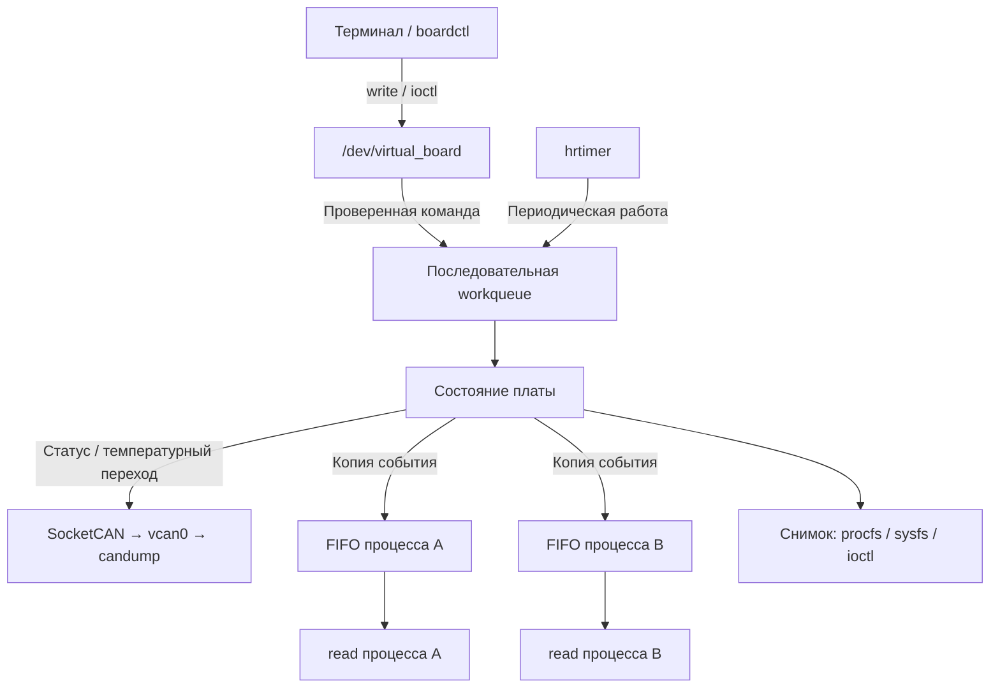

<div align="center">

Действующее распределение управления и наблюдения: [таблица интерфейсов](docs/INTERFACES.md). После загрузки управление идёт через /dev; sysfs показывает текущие значения только для чтения.

# Virtual Board

**Виртуальная плата температурного контроля в ядре Linux**

`C` · `Linux Kernel Module` · `SocketCAN` · `Character Device`

Проект курса OTUS по разработке ядра Linux · Уровень **Medium**

</div>

---

> **Статус на 21.09.2026:** CAN-уведомления 0x124 и периодические статусы 0x123 получены в candump. hrtimer и управление start/stop реализованы; сборка и выгрузка проверены. Подтверждены stop, запуск после остановки и период около 1 с при period_ms=1000. Повторные команды без смены состояния ещё проверяем. read/ioctl, персональные FIFO и boardctl впереди.

[Протокол и параметры](docs/PROTOCOL.md) · [Отчёт о разработке и испытаниях](docs/REPORT.md) · [Рабочая презентация](docs/presentation/README.md)

## Идея проекта

Virtual Board эмулирует плату, которая контролирует температуру и передаёт своё состояние по CAN. Температуру задаёт пользователь: физический датчик и CAN-адаптер не требуются. Виртуальный интерфейс `vcan0` позволяет наблюдать сообщения стандартной утилитой `candump`.

Проект объединяет управление символьным устройством, периодическую работу в ядре, сетевой обмен и доставку событий нескольким процессам. Его ключевая особенность — **персональная очередь событий каждого процесса**: чтение одним клиентом не забирает данные у остальных.

## Возможности

| Направление | Планируемое поведение |
| --- | --- |
| Температурный контроль | Задание температуры и пределов, определение нормы, перегрева и переохлаждения |
| Управление | Команды через `write` и `ioctl`, консольная утилита `boardctl` на C |
| Локальные события | Чтение через `read`, независимый FIFO каждого процесса, учёт переполнения |
| CAN | Периодический статус и отдельные уведомления о температурных переходах |
| Наблюдение | Сводка в `/proc`, отдельные атрибуты в `/sys`, кадры в `candump` |
| Завершение | Остановка таймера и работ, освобождение памяти и удаление интерфейсов |

Объём проекта — одна виртуальная плата и один CAN-интерфейс. Управление выполняется локально; приём управляющих команд по CAN в текущий объём не входит.

## Как это работает



Команды и периодическая отправка выполняются в одной последовательной workqueue. Callback таймера только ставит работу в очередь. Читатели получают события непосредственно из своих FIFO; ожидание данных не занимает worker.

Архитектура опирается на решения лекций и домашних заданий курса: общий контекст модуля, `cdev`, `kfifo`, списки, mutex, `hrtimer`, workqueue, completion и сокеты ядра. Для CAN адаптируется изученный путь `sock_create_kern` → `kernel_bind` → `kernel_sendmsg` → `sock_release`.

### Два независимых состояния

| Поле | Значения | Смысл |
| --- | --- | --- |
| `state` | `stopped`, `running` | Остановлена или включена CAN-передача |
| `temp_status` | `normal`, `undertemp`, `overheat` | Положение температуры относительно заданных пределов |

Нижняя и верхняя границы входят в нормальный диапазон. Выход за пределы вызывает температурное уведомление, но не останавливает передачу. При возвращении в диапазон состояние автоматически становится `normal`. В режиме `stopped` локальный контроль температуры продолжается.

### Персональные очереди

- Состояние платы общее, очередь событий у каждого процесса своя.
- Потоки и повторные открытия одного процесса используют общий клиентский контекст.
- Медленный читатель не задерживает других клиентов и CAN-передачу.
- При переполнении отбрасывается новое событие только у соответствующего клиента и увеличивается его счётчик потерь.
- Короткое чтение сохраняет остаток записи для следующего вызова.
- Пустое блокирующее чтение ожидает событие; при `O_NONBLOCK` возвращается `EAGAIN`.

Правила наследования дескрипторов через `fork`, ёмкость FIFO и предел числа клиентов будут закреплены до реализации этой части.

## Интерфейсы

Узел /dev и класс в sysfs создаются при загрузке; write для temp/limits реализован и испытан. Остальные операции и атрибуты состояния в таблице — план.

| Интерфейс | Назначение |
| --- | --- |
| `/dev/virtual_board` · `write` | Задание температуры и пределов, запуск и остановка |
| `/dev/virtual_board` · `read` | Локальные события из очереди вызывающего процесса |
| `/dev/virtual_board` · `ioctl` | Настройка пределов и периода, получение состояния |
| `/proc/virtual_board` | Сводка параметров, состояний и потерь событий |
| `/sys/class/virtual_board/virtual_board/` | Атрибуты температуры, пределов и состояний только для чтения |
| `vcan0` | CAN-статус и уведомления, доступные внешним наблюдателям |

Параметры, команды, события и CAN-кадры описаны в [спецификации протокола](docs/PROTOCOL.md). Общий интерфейс модуля и утилиты определён в [`include/virtual_board_uapi.h`](include/virtual_board_uapi.h).

## Структура репозитория

```text
virtual_board/
├── Makefile                    # Сборка модуля и утилиты, загрузка и выгрузка
├── Kbuild                      # Объекты составного модуля
├── include/
│   └── virtual_board_uapi.h     # Общий интерфейс ioctl
├── src/
│   ├── board.h                 # Внутренние структуры и прототипы
│   ├── main.c                  # Инициализация, завершение, откат ошибок
│   ├── params.c                # Параметры загрузки и проверка значений
│   ├── board.c                 # Логика температуры и состояний
│   ├── worker.c                # Таймер и обработчики работ
│   ├── chardev.c               # Регистрация устройства и файловые операции
│   ├── clients.c               # Контексты процессов, FIFO и доставка событий
│   ├── can.c                   # Сокет CAN, упаковка и отправка кадров
│   ├── proc.c                  # Сводка procfs
│   └── sysfs.c                 # Атрибуты sysfs
├── tools/
│   └── boardctl.c              # Пользовательская утилита ioctl
├── tests/                      # Будущие проверки на C и shell
├── .gitignore
└── README.md
```

Makefile, Kbuild, UAPI, main.c, params.c, board.c, worker.c и регистрация устройства с write в chardev.c подготовлены. Минимальный путь команд собран и испытан 21.09. Остальные компоненты и boardctl пока являются заготовками. Имена файлов отражают распределение ответственности, а не готовность соответствующих компонентов. Каталог `tests/` появится в Git вместе с первыми проверками.

## Среда разработки

Первичная проверка выполнена **17 сентября 2026 года**.

| Компонент | Текущая среда |
| --- | --- |
| ОС | Linux Mint 22, x86_64 |
| Ядро | `6.8.0-38-generic` |
| Компилятор | GCC 13.2.0 |
| Сборка | GNU Make 4.3, заголовки текущего ядра доступны |
| Сеть | Утилиты `ip` и `candump` доступны |
| Поддержка CAN | `CONFIG_CAN=m`, `CONFIG_CAN_RAW=m`, `CONFIG_CAN_VCAN=m` |

Это сведения о рабочем окружении, а не заявление о проверенной совместимости модуля. Конфигурация фактически используемого ядра будет добавлена в репозиторий вместе с описанием её происхождения.

## Сборка и запуск

Из каталога репозитория выполните `make`. Проверенная 21.09.2026 сборка для ядра 6.8.0-38-generic создаёт `virtual_board.ko`. Модуль проверяет параметры, создаёт очередь работ, регистрирует устройство и принимает temp/limits через write. Загрузка и выгрузка этой версии проверены. make check пока сообщает 0 ошибок и 17 предупреждений оформления и возвращает код 1.

Перед загрузкой нужен существующий CAN-интерфейс vcan0 (подготовка описана ниже). Проверенный сценарий после сборки:

```bash
make load
sudo dmesg | tail -n 20
make unload
sudo dmesg | tail -n 5
```

Цели вызывают `sudo insmod ./virtual_board.ko` и `sudo rmmod virtual_board`. В журнале получены сообщения `virtual_board: module loaded` и `virtual_board: module unloaded`. Этот сценарий проверяет только жизненный цикл минимального модуля.

### Проверенный минимальный write

После загрузки с параметрами по умолчанию:

```bash
sudo sh -c 'printf "temp 300\n" > /dev/virtual_board'
sudo sh -c 'printf "limits 100 250\n" > /dev/virtual_board'
sudo sh -c 'printf "temp 250\n" > /dev/virtual_board'
sudo sh -c 'printf "temp 99\n" > /dev/virtual_board'
sudo sh -c 'printf "temp 100\n" > /dev/virtual_board'
sudo dmesg | grep 'virtual_board:' | tail -n 5
```

Значения — десятые доли °C. Подтверждены статусы 0 → 2 → 0 → 1 → 0: норма, перегрев, норма, низкая температура, норма. Значения ровно на обоих пределах входят в норму. Результат виден в журнале. После корректировки 21.09 числовые параметры в /sys/module читают текущее board.status; новая версия собрана, проверка в ядре пока не выполнена.

Отклонены команды `temp 1251`, `limits 700 100`, `temp 200 extra`: shell вернул 1 и общее сообщение I/O error. Точный errno системного write этим способом не измерен. После отказов допустимые команды работают, пределы остались 100/250. Подробности и ограничения испытаний — раздел 5.13 отчёта.

После проверки выполните `make unload`. В проверенном цикле узел, класс и запись в /proc/devices исчезли. start/stop теперь управляют разрешением CAN-уведомлений; периодическая передача подключена; stop и запуск после остановки проверены.

Примеры read и boardctl появятся после реализации. Подготовка CAN-шины проверена независимо от модуля и описана ниже.

### Проверенные CAN-уведомления

На поднятом vcan0 запустите `candump vcan0` в отдельном терминале до отправки команд. После свежей загрузки модуля с параметрами по умолчанию:

```bash
sudo sh -c 'printf "start\n" > /dev/virtual_board'
sudo sh -c 'printf "temp 850\n" > /dev/virtual_board'
# 124 [8] 52 03 64 00 BC 02 02 01 — перегрев
sudo sh -c 'printf "temp 900\n" > /dev/virtual_board'
# Нового уведомления нет: статус не изменился.
sudo sh -c 'printf "temp 250\n" > /dev/virtual_board'
# 124 [8] FA 00 64 00 BC 02 00 01 — возврат в норму
sudo sh -c 'printf "stop\n" > /dev/virtual_board'
sudo sh -c 'printf "temp 850\n" > /dev/virtual_board'
# В stopped температура обновляется, кадра нет.
```

После проверки — `make unload`. Код успешного write подтверждает применение команды; ошибку CAN модуль пишет в журнал без отката состояния. Периодические кадры 0x123 также получены; см. ниже. События персональных FIFO ещё не реализованы.

### Периодический статус

На поднятом vcan0 после загрузки и команды `start` получены повторяющиеся кадры:

```text
vcan0  123   [8]  FA 00 64 00 BC 02 00 01
```

Это 25 °C, пределы 10–70 °C, normal и running. Двухбайтовые числа передаются младшим байтом вперёд. Период по умолчанию — 100 мс; для наблюдения проверена загрузка с периодом 1 с:

```bash
sudo insmod ./virtual_board.ko period_ms=1000
```

В отдельном терминале `candump -t a vcan0` показывает временные метки. После start интервалы между кадрами около 1 с (первые два: 1,000008 с). stop прекращает кадры, следующий start возобновляет передачу раз в секунду. Финальный stop вернул 0, make unload завершился успешно. Ctrl+C в candump завершает только наблюдение. Повторные start при running и stop при stopped ещё требуют полной проверки. Подробности — REPORT.md, 5.16.

### Номер символьного устройства

После загрузки модуль резервирует один номер устройства и выводит major/minor в журнал. Команда `grep -w virtual_board /proc/devices` показывает регистрацию. В проверке 18.09 получен номер 511:0; после make unload запись исчезла. Номер major выбирает ядро, поэтому при следующих загрузках он может отличаться.

Зарегистрированы cdev, класс и объект устройства. Проверены `ls -l /dev/virtual_board` и `cat /sys/class/virtual_board/virtual_board/dev`: символьный узел с правами 0600, root:root, номер совпал с 511:0 в sysfs и журнале. После make unload оба пути `/dev/virtual_board` и `/sys/class/virtual_board` отсутствовали, запись номера исчезла. Обработчик write назначен; read/ioctl ещё не реализованы. Штатный `/proc/devices` не заменяет запланированный `/proc/virtual_board`.

### Параметр имени интерфейса

`modinfo -p ./virtual_board.ko` показывает описание строкового параметра `can_iface`. После загрузки его значение доступно только для чтения:

```bash
cat /sys/module/virtual_board/parameters/can_iface
```

Без аргумента проверено значение `vcan0`. После выгрузки и загрузки командой `sudo insmod ./virtual_board.ko can_iface=vcan1` проверено значение `vcan1`. Модуль проверяет допустимость имени через dev_valid_name до успешного завершения init. Проверены отказ загрузки для bad/name и успешная загрузка с vcan0 после отказа. Теперь модуль проверяет существование и CAN-тип интерфейса, создаёт собственный сокет, отключает его приём и выполняет привязку. Создание интерфейса остаётся задачей пользователя. Отправка кадров проверена 21.09 (см. сценарии выше). На vcan0 загрузка и выгрузка проверены 21.09; vb_missing и lo отклонены до создания сокета. Исторический тест имени vcan1 проверял только параметр: теперь для успешной загрузки такой CAN-интерфейс должен существовать. Цель make load не передаёт аргументы параметров.

### Числовые параметры загрузки

| Параметр | По умолчанию | Допустимые значения |
| --- | --- | --- |
| temperature_decic | 250 | −400…1250, десятые доли °C |
| low_decic | 100 | −400…1250, строго меньше high_decic |
| high_decic | 700 | −400…1250 |
| period_ms | 100 | 10…60000 мс |

Числовые параметры в `/sys/module/virtual_board/parameters/` читают текущее состояние и доступны только для чтения (0444). `can_iface` остаётся только для чтения (0444). При загрузке значения проверяются до создания ресурсов. Число 253 означает 25,3 °C; вычисления целочисленные. Температура может выходить за настроенные пределы low/high, оставаясь в общем допустимом диапазоне.

Проверена загрузка с `temperature_decic=-400 low_decic=-400 high_decic=1250 period_ms=10` и чтение этих значений через sysfs. Проверены отказы для temperature_decic=1251, low_decic=-401, high_decic=1251, переставленных пределов 700/100 и period_ms=9. Команды и результаты — в разделе 5.9 отчёта. Температурная логика проверена через write 21.09; таймер реализован; период ещё не измерен.

### Подготовка виртуальной CAN-шины

Команды выполняются в терминале Linux Mint. Адаптер USB–CAN не нужен: для тестов используем виртуальный `vcan0`. Физический `can0` относится к адаптеру и не заменяет этот интерфейс.

Посмотреть существующие виртуальные интерфейсы:

```bash
ip -details link show type vcan
```

Загрузить драйвер и **создать интерфейс, только если `vcan0` отсутствует**:

```bash
sudo modprobe vcan
sudo ip link add dev vcan0 type vcan
```

Включить интерфейс и проверить его:

```bash
sudo ip link set dev vcan0 up
ip -details link show vcan0
```

В проверенном выводе присутствуют `UP,LOWER_UP` и тип `vcan`. Значение `state UNKNOWN` в этом выводе не помешало успешному обмену. Скорость `bitrate` и параметр `loopback on` для этой настройки не задаём.

Если интерфейс уже существует, команду `ip link add` пропускаем. После перезагрузки проверяем наличие заново: постоянная настройка создания интерфейса в проекте пока не предусмотрена.

### Проверка передачи кадра

В первом терминале запустить приём **до отправки**:

```bash
candump vcan0
```

Во втором терминале:

```bash
cansend vcan0 123#11223344
```

Полученный результат проверки от 17.09.2026:

```text
vcan0  123   [4]  11 22 33 44
```

Остановить `candump` — `Ctrl+C`. Если открытие CAN RAW socket сообщает об отсутствии поддержки протокола, загрузить `sudo modprobe can_raw` и повторить проверку.

Это проверка среды стандартными утилитами. ID `0x123` и четыре байта — тестовые данные, а не утверждённый протокол платы. Кадры самого модуля описаны в проверках выше.


## Этапы разработки

- [x] Определить назначение и объём проекта.
- [x] Подготовить архитектуру на основе материалов курса.
- [x] Создать структуру исходников и выполнить первичную проверку среды.
- [x] Создать `vcan0` и проверить обмен между `cansend` и `candump`.
- [x] Собрать и загрузить минимальный модуль, проверить первый CAN-кадр.
- [ ] Реализовать температурный контроль и периодическую передачу.
- [ ] Реализовать персональные очереди и чтение событий.
- [ ] Добавить `ioctl`, `boardctl`, procfs и sysfs.
- [ ] Проверить ошибки, конкурентные обращения и освобождение ресурсов.
- [ ] Подготовить воспроизводимую демонстрацию и итоговую документацию.

## Что будет проверяться

Температурные переходы и точные границы диапазона; запуск и остановка; содержимое CAN-кадров; независимость читателей; частичное чтение и переполнение; неверные команды; исчезновение CAN-интерфейса; повторные циклы загрузки и выгрузки.

Результаты испытаний будут добавляться по мере реализации. Каждая завершённая возможность должна подтверждаться проверкой её поведения.

### Управление и наблюдение (22.09)

Единственное хранилище температуры, пределов и периода — `board.status`. Аргументы insmod задают начальные значения; после загрузки параметры sysfs только показывают текущее состояние. Запись числовых параметров через sysfs удалена. Таблица путей, назначения и готовности — [INTERFACES.md](docs/INTERFACES.md).

`make` собирает модуль и утилиту `tools/boardctl`. Управление:

```bash
sudo sh -c 'echo "temp 850" > /dev/virtual_board'
sudo ./tools/boardctl limits 100 700
sudo ./tools/boardctl period 1000
sudo ./tools/boardctl status
cat /sys/module/virtual_board/parameters/temperature_decic
```

`boardctl` использует ioctl того же /dev/virtual_board. Период меняется через общую очередь команд: при running таймер начинает новый интервал, при stopped передача остаётся остановленной. GET_STATUS возвращает текущий снимок и не потребляет событие из FIFO.

22.09 подтверждены загрузка, GET_STATUS, SET_LIMITS, SET_PERIOD при stopped, согласованное чтение sysfs и получение одинаковых четырёх событий двумя независимыми cat. Восемь неверных вариантов CLI отклонены при отдельной проверке. Короткое чтение, переполнение, сигналы, отрицательные ioctl и смена периода при running ещё не проверены. Подготовлен сценарий `sudo python3 tests/test_params.py` для vcan0 UP и выгруженного модуля; загрузку и проверку выполняет пользователь.
