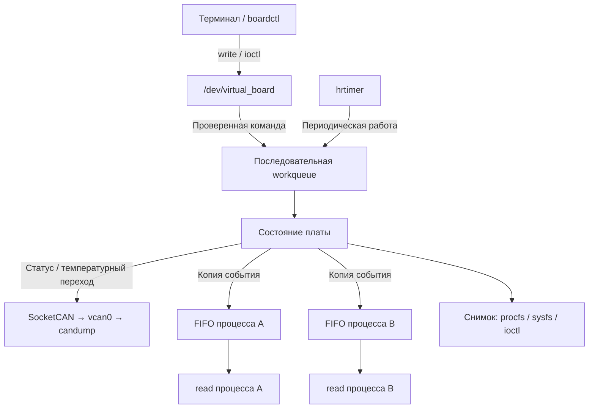

<div align="center">

# Virtual Board

**Виртуальная плата температурного контроля в ядре Linux**

`C` · `Linux Kernel Module` · `SocketCAN` · `Character Device`

Проект курса OTUS по разработке ядра Linux · Уровень **Medium**

</div>

---

> **Статус: подготовка к реализации.** Созданы структура проекта и заготовки исходников. Модуль и утилита пока не реализованы; сборка, загрузка и функциональные испытания ещё не выполнялись. Ниже описана целевая архитектура и запланированное поведение.

## Идея проекта

Virtual Board эмулирует плату, которая контролирует температуру и передаёт своё состояние по CAN. Температуру задаёт пользователь: физический датчик и CAN-адаптер не требуются. Виртуальный интерфейс `vcan0` позволяет наблюдать сообщения стандартной утилитой `candump`.

Проект объединяет управление символьным устройством, периодическую работу в ядре, сетевой обмен и доставку событий нескольким процессам. Его ключевая особенность — **персональная очередь событий каждого процесса**: чтение одним клиентом не забирает данные у остальных.

## Возможности

| Направление | Планируемое поведение |
| --- | --- |
| Температурный контроль | Задание температуры и пределов, определение нормы, перегрева и переохлаждения |
| Управление | Команды через `write` и `ioctl`, консольная утилита `boardctl` на C |
| Локальные события | Чтение через `read`, независимый FIFO каждого процесса, учёт переполнения |
| CAN | Периодический статус и отдельные уведомления о температурных переходах |
| Наблюдение | Сводка в `/proc`, отдельные атрибуты в `/sys`, кадры в `candump` |
| Завершение | Остановка таймера и работ, освобождение памяти и удаление интерфейсов |

Объём проекта — одна виртуальная плата и один CAN-интерфейс. Управление выполняется локально; приём управляющих команд по CAN в текущий объём не входит.

## Как это работает



Команды и периодическая отправка выполняются в одной последовательной workqueue. Callback таймера только ставит работу в очередь. Читатели получают события непосредственно из своих FIFO; ожидание данных не занимает worker.

Архитектура опирается на решения лекций и домашних заданий курса: общий контекст модуля, `cdev`, `kfifo`, списки, mutex, `hrtimer`, workqueue, completion и сокеты ядра. Для CAN адаптируется изученный путь `sock_create_kern` → `kernel_bind` → `kernel_sendmsg` → `sock_release`.

### Два независимых состояния

| Поле | Значения | Смысл |
| --- | --- | --- |
| `state` | `stopped`, `running` | Остановлена или включена CAN-передача |
| `temp_status` | `normal`, `undertemp`, `overheat` | Положение температуры относительно заданных пределов |

Нижняя и верхняя границы входят в нормальный диапазон. Выход за пределы вызывает температурное уведомление, но не останавливает передачу. При возвращении в диапазон состояние автоматически становится `normal`. В режиме `stopped` локальный контроль температуры продолжается.

### Персональные очереди

- Состояние платы общее, очередь событий у каждого процесса своя.
- Потоки и повторные открытия одного процесса используют общий клиентский контекст.
- Медленный читатель не задерживает других клиентов и CAN-передачу.
- При переполнении отбрасывается новое событие только у соответствующего клиента и увеличивается его счётчик потерь.
- Короткое чтение сохраняет остаток записи для следующего вызова.
- Пустое блокирующее чтение ожидает событие; при `O_NONBLOCK` возвращается `EAGAIN`.

Правила наследования дескрипторов через `fork`, ёмкость FIFO и предел числа клиентов будут закреплены до реализации этой части.

## Интерфейсы

Все перечисленные интерфейсы появятся после реализации и загрузки модуля.

| Интерфейс | Назначение |
| --- | --- |
| `/dev/virtual_board` · `write` | Задание температуры и пределов, запуск и остановка |
| `/dev/virtual_board` · `read` | Локальные события из очереди вызывающего процесса |
| `/dev/virtual_board` · `ioctl` | Настройка пределов и периода, получение состояния |
| `/proc/virtual_board` | Сводка параметров, состояний и потерь событий |
| `/sys/class/virtual_board/virtual_board/` | Атрибуты температуры, пределов и состояний только для чтения |
| `vcan0` | CAN-статус и уведомления, доступные внешним наблюдателям |

Точные текстовые команды, номера `ioctl`, CAN ID и формат полезной нагрузки ещё не зафиксированы. Общий интерфейс модуля и утилиты будет описан в [`include/virtual_board_uapi.h`](include/virtual_board_uapi.h).

## Структура репозитория

```text
virtual_board/
├── Makefile                    # Сборка модуля и утилиты, загрузка и выгрузка
├── Kbuild                      # Объекты составного модуля
├── include/
│   └── virtual_board_uapi.h     # Общий интерфейс ioctl
├── src/
│   ├── board.h                 # Внутренние структуры и прототипы
│   ├── main.c                  # Инициализация, завершение, откат ошибок
│   ├── params.c                # Параметры загрузки и проверка значений
│   ├── board.c                 # Логика температуры и состояний
│   ├── worker.c                # Таймер и обработчики работ
│   ├── chardev.c               # Регистрация устройства и файловые операции
│   ├── clients.c               # Контексты процессов, FIFO и доставка событий
│   ├── can.c                   # Сокет CAN, упаковка и отправка кадров
│   ├── proc.c                  # Сводка procfs
│   └── sysfs.c                 # Атрибуты sysfs
├── tools/
│   └── boardctl.c              # Пользовательская утилита ioctl
├── tests/                      # Будущие проверки на C и shell
├── .gitignore
└── README.md
```

Исходники, Makefile и Kbuild пока являются заготовками. Имена файлов отражают распределение ответственности, а не готовность соответствующих компонентов. Каталог `tests/` появится в Git вместе с первыми проверками.

## Среда разработки

Первичная проверка выполнена **17 сентября 2026 года**.

| Компонент | Текущая среда |
| --- | --- |
| ОС | Linux Mint 22, x86_64 |
| Ядро | `6.8.0-38-generic` |
| Компилятор | GCC 13.2.0 |
| Сборка | GNU Make 4.3, заголовки текущего ядра доступны |
| Сеть | Утилиты `ip` и `candump` доступны |
| Поддержка CAN | `CONFIG_CAN=m`, `CONFIG_CAN_RAW=m`, `CONFIG_CAN_VCAN=m` |

Это сведения о рабочем окружении, а не заявление о проверенной совместимости модуля. Конфигурация фактически используемого ядра будет добавлена в репозиторий вместе с описанием её происхождения.

## Сборка и запуск

Инструкции будут добавлены после проверки первого работающего модуля. Сейчас `Makefile` и `Kbuild` пусты, поэтому проект ещё нельзя собрать или загрузить.

В этом разделе появятся воспроизводимые команды сборки, подготовки `vcan0`, загрузки и выгрузки, а также примеры `read`, `write`, `boardctl` и наблюдения через `candump`.

## Этапы разработки

- [x] Определить назначение и объём проекта.
- [x] Подготовить архитектуру на основе материалов курса.
- [x] Создать структуру исходников и выполнить первичную проверку среды.
- [ ] Собрать и загрузить минимальный модуль, проверить первый CAN-кадр.
- [ ] Реализовать температурный контроль и периодическую передачу.
- [ ] Реализовать персональные очереди и чтение событий.
- [ ] Добавить `ioctl`, `boardctl`, procfs и sysfs.
- [ ] Проверить ошибки, конкурентные обращения и освобождение ресурсов.
- [ ] Подготовить воспроизводимую демонстрацию и итоговую документацию.

## Что будет проверяться

Температурные переходы и точные границы диапазона; запуск и остановка; содержимое CAN-кадров; независимость читателей; частичное чтение и переполнение; неверные команды; исчезновение CAN-интерфейса; повторные циклы загрузки и выгрузки.

Результаты испытаний будут добавляться по мере реализации. Каждая завершённая возможность должна подтверждаться проверкой её поведения.
