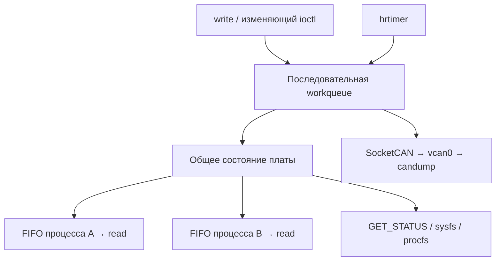

# Virtual Board

Виртуальная CAN-плата температурного контроля — модуль ядра Linux и консольная утилита `boardctl`. Проект курса OTUS, уровень **Medium**: каждый процесс имеет собственный буфер событий.

Цель — воспроизводимый источник CAN-сообщений для проверки управляющего ПО без физической платы. Пользователь задаёт температуру; модуль определяет норму, перегрев или низкую температуру и передаёт результат через SocketCAN в `vcan0`.

[Инструкция для проверяющего](#demonstration) · [Интерфейсы](#interfaces) · [Документы и презентация](docs/README.md)

Реализованы `read`, `write`, `ioctl`, персональные FIFO, таймер и CAN, procfs и sysfs. 23.09.2026 пользователь успешно выполнил автоматизированный прогон проверок 1–3 через `tests/readme_demo.py`, включая выгрузку модуля. Результаты прогона кратко приведены в [заметках к слайду 31](docs/SPEAKER_NOTES.md); ограничения указаны ниже. Приведённая ниже инструкция описывает **ожидаемые результаты повторной проверки**. Дополнительная проверка 4 в этот прогон не входила.

## Устройство проекта



- `state`: `stopped` или `running`; управляет CAN-передачей.
- `temp_status`: `normal`, `undertemp`, `overheat`; определяется температурой и пределами. Обе границы входят в норму. `stop` сохраняет температуру и диагноз.
- Температура и пределы задаются в **десятых долях °C**: `850` означает 85 °C. Диапазон −40…125 °C, нижний предел строго меньше верхнего.
- CAN ID `0x123` — периодический статус; `0x124` — смена температурного статуса. Оба передаются только при `running`. Период по умолчанию 100 мс, допустимо 10–60 000 мс.
- До восьми клиентских процессов, FIFO по 64 события. При переполнении отбрасывается новое событие и увеличивается `lost_events` данного клиента.
- Потоки и повторные открытия одного процесса разделяют FIFO. Независимые процессы получают независимые копии. `dup` разделяет файловый объект; чтение унаследованного открытия другим процессом возвращает `EXDEV`, требуется новый `open`.
- Пустой `read` ждёт; `O_NONBLOCK` возвращает `EAGAIN`. Короткое чтение сохраняет остаток строки. Новый читатель не получает историю до своего открытия или начальный снимок.

Персональные FIFO не хранят периодические CAN-кадры. Модуль передаёт CAN независимо от наличия читателей `/dev`; приём команд через CAN не реализован.

<a id="interfaces"></a>
## Интерфейсы пользователя

Управление после загрузки выполняется через `/dev/virtual_board`. Все интерфейсы состояния используют единое `board.status`.

| Интерфейс | Назначение и пример |
| --- | --- |
| `/dev/virtual_board`, `write` | Текстовые команды `temp N`, `limits LOW HIGH`, `start`, `stop`; один вызов — одна полная команда |
| `/dev/virtual_board`, `read` | `sudo cat /dev/virtual_board` — новые события процесса; при пустоте ждёт, выход Ctrl+C |
| `/dev/virtual_board`, `ioctl` | `sudo ./tools/boardctl status`, `limits 100 700`, `period 1000`; GET_STATUS, SET_LIMITS, SET_PERIOD |
| `/proc/virtual_board` | `cat /proc/virtual_board` — снимок платы и клиентов: `pid`, `opens`, `readers`, `lost_events` |
| `/sys/class/virtual_board/virtual_board/state` | `running` или `stopped`, только чтение |
| `/sys/class/virtual_board/virtual_board/temp_status` | `normal`, `undertemp`, `overheat`, только чтение |
| `/sys/module/virtual_board/parameters/` | `temperature_decic`, `low_decic`, `high_decic`, `period_ms` — текущие числа; `can_iface` — выбранный интерфейс. Права 0444 |
| `vcan0` | `candump -t a vcan0` — CAN-кадры с абсолютными временными метками |

`boardctl status` сразу возвращает согласованный снимок всех полей и завершается. Чтение каждого sysfs-файла — отдельный запрос. Procfs фиксирует сводку при открытии и отдаёт её частями до EOF; новое открытие даёт новый снимок. Чтение procfs не подписывает процесс на события и не увеличивает `clients`.

Начальные значения можно передать как параметры `insmod`: `can_iface`, `temperature_decic`, `low_decic`, `high_decic`, `period_ms`. После загрузки sysfs используется только для наблюдения. Контракт ioctl: [общий UAPI](include/virtual_board_uapi.h).

## Среда и сборка

Рабочая и проверенная среда: Linux Mint 22, x86_64, ядро `6.8.0-38-generic`, GCC 13.2.0. Нужны GNU Make, компилятор, заголовки работающего ядра, `ip` из iproute2, `candump` из can-utils и права `sudo` для загрузки модуля и настройки интерфейса. Ядро должно поддерживать CAN, CAN_RAW и VCAN.

В Mint/Ubuntu соответствующие пакеты: `build-essential`, `linux-headers-$(uname -r)`, `iproute2`, `can-utils`. Совместимость с другими версиями ядра отдельно не заявляется.

Откройте Bash в каталоге клона `virtual_board/`, где находятся `Makefile`, `Kbuild`, `src/` и `tools/`:

```bash
uname -r
command -v gcc make ip candump
ls -ld "/lib/modules/$(uname -r)/build"
make
```

Продолжайте только при успешной сборке. Результаты: `virtual_board.ko` и `tools/boardctl`.

| Цель Makefile | Действие |
| --- | --- |
| `make` | Сборка модуля и `boardctl` |
| `make boardctl` | Сборка пользовательской утилиты |
| `make load` | Сборка модуля и `sudo insmod ./virtual_board.ko` с параметрами по умолчанию; vcan0 должен быть подготовлен |
| `make unload` | `sudo rmmod virtual_board`; предварительно закрыть читателей |
| `make clean` | Удаление результатов сборки |
| `make check` | Проверка оформления через checkpatch; не runtime-тест |

В демонстрации ниже используется явный `insmod` с периодом 1000 мс, чтобы кадры было удобно наблюдать. Это альтернатива `make load`, а не следующая за ним команда.

В репозитории находится ранее согласованный `.config` для Linux 7.0.3. Для проекта включены модули `CONFIG_CAN=m`, `CONFIG_CAN_RAW=m`, `CONFIG_CAN_DEV=m` и `CONFIG_CAN_VCAN=m`. Конфигурация проверена через `conf --olddefconfig` из локальных исходников Linux 7.0.3; изменения ограничены опциями CAN. Ядро с обновлённой конфигурацией ещё не собрано и не загружено: подтверждённый прогон относится к 6.8.0-38-generic. Для применения нужны сборка и установка ядра и его модулей, загрузка нового ядра, пересборка virtual_board под него и повторный прогон README.

<a id="demonstration"></a>
## Инструкция для проверяющего

Проверки 1–3 выполните **по порядку в одной сессии**. Они покрывают демонстрацию из утверждённого описания: температурные переходы и границы, два читателя, ioctl, ошибочный ввод, остановка и выгрузка. Проверка 4 с CAN down/up — дополнительная. После проверок обязательно выполните завершение.

Откройте четыре терминала:

| Терминал | Роль |
| --- | --- |
| A | Управление; Bash в каталоге `virtual_board/` |
| B и C | Два независимых читателя `/dev/virtual_board` |
| D | Наблюдение CAN через `candump` |

Команды для разных терминалов не вставляйте одним блоком в одну оболочку: `cat` и `candump` работают до Ctrl+C. Другие отправители CAN и дополнительные читатели во время демонстрации не нужны. При неожиданном результате сохраните команду, вывод и остановитесь на этом шаге.

Для автоматизированной проверки сценариев 1–3 после `make` можно вместо ручного
прохода выполнить из каталога `virtual_board/`:

```bash
sudo python3 tests/readme_demo.py
```

Сценарий требует Python 3, сам загружает модуль с параметрами ниже, запускает два
процесса `cat` и `candump`, сравнивает события, CAN-данные, ioctl, procfs и sysfs,
проверяет отказ неверной команды. При завершении, в том числе при ошибке проверки,
он останавливает плату, закрывает свои процессы и пытается выгрузить модуль.
Уже загруженный модуль сценарий не заменяет: сначала завершите прежнюю сессию.
Существующий `vcan0` должен иметь тип `vcan` и быть поднят; отсутствующий интерфейс
будет создан. После прогона интерфейс остаётся на месте.

Путь к журналам печатается при запуске: `/tmp/virtual-board-readme-…/`.
`run.log` содержит команды, результаты и итог, `reader-b.log`, `reader-c.log` и
`can.log` — вывод приложений; для чтения файлов, созданных от root, используйте
`sudo`. Ошибка даёт ненулевой код завершения. Проверка 4 выполняется отдельно
вручную. Наличие сценария не означает успешного прогона: результат подтверждает
только его журнал. Это автоматизированный эквивалент проверок, а не проверка
копирования всех команд README в четыре терминала.

### Подготовка: известное начальное состояние

В **A** определите вспомогательную функцию. Она записывает одну команду через `write` и убирает повтор текста от `tee`; сообщения об ошибках остаются видимыми. Терминал A сохраняйте открытым до конца.

```bash
vbwrite() {
    printf '%s\n' "$1" | sudo tee /dev/virtual_board >/dev/null
}
test -d /sys/module/virtual_board && echo 'Модуль уже загружен'
```

Если напечатано «Модуль уже загружен», сначала выполните [завершение](#shutdown), включая закрытие прежних читателей и выгрузку. Затем продолжите подготовку. Если модуль отсутствует, `test` молчит и возвращает ненулевой код — здесь это нормально.

Подготовьте виртуальный интерфейс в **A**:

```bash
sudo modprobe vcan
if ! ip link show dev vcan0 >/dev/null 2>&1; then
    sudo ip link add dev vcan0 type vcan
fi
ip -details link show dev vcan0
```

Убедитесь, что существующий интерфейс имеет тип `vcan`, затем поднимите его и загрузите модуль с явными параметрами:

```bash
sudo ip link set dev vcan0 up
sudo insmod ./virtual_board.ko can_iface=vcan0 \
    temperature_decic=250 low_decic=100 high_decic=700 period_ms=1000
sudo ./tools/boardctl status
ls -ld /dev/virtual_board /proc/virtual_board \
    /sys/class/virtual_board/virtual_board
```

Ожидаемый `status`:

```text
temp=250 low=100 high=700 period_ms=1000 state=stopped temp_status=normal
```

Все три пути должны существовать. Если загрузка не удалась, не переходите к тестам; диагностические сообщения можно получить через `sudo dmesg | tail -n 30`.

В **B** и **C** отдельно выполните одну и ту же команду:

```bash
sudo cat /dev/virtual_board
```

В **D**:

```bash
candump -t a vcan0
```

В **A**:

```bash
cat /proc/virtual_board
```

Дождитесь `clients=2` и двух строк с разными PID, `opens=1 readers=1 lost_events=0`. Числа PID зависят от запуска. B/C пока молчат, а в D нет кадров нашего модуля: начальных событий нет, передача остановлена.

### Проверка 1: температура, границы, два читателя и CAN

Исходные условия: `stopped/normal`, температура 25 °C, пределы 10–70 °C, период 1000 мс. B/C/D работают. Все команды — в **A**. После каждой команды сравнивайте `status`, события B/C и кадры D; паузы позволяют увидеть периодическую передачу.

```bash
vbwrite start
sleep 3
sudo ./tools/boardctl status
vbwrite 'temp 850'
sleep 2
sudo ./tools/boardctl status
vbwrite 'temp 500'
sleep 2
sudo ./tools/boardctl status
vbwrite 'temp 50'
sleep 2
sudo ./tools/boardctl status
vbwrite 'temp 100'
sleep 2
sudo ./tools/boardctl status
vbwrite 'temp 700'
sleep 2
sudo ./tools/boardctl status
vbwrite stop
sleep 3
sudo ./tools/boardctl status
```

Ожидаемые изменения (`low=100 high=700 period_ms=1000` сохраняются):

| Действие | Температура | `state / temp_status` | Новое событие в каждом из B/C | CAN в D |
| --- | --- | --- | --- | --- |
| `start` | 25 °C | running / normal | `started` | Периодические `123`, примерно раз в 1 с |
| `temp 850` | 85 °C | running / overheat | `temp_transition`, overheat | `124` о перегреве; `123` продолжаются |
| `temp 500` | 50 °C | running / normal | `temp_transition`, normal | `124` о восстановлении |
| `temp 50` | 5 °C | running / undertemp | `temp_transition`, undertemp | `124` о низкой температуре |
| `temp 100` | 10 °C | running / normal | `temp_transition`, normal | `124` о возврате на нижнюю границу |
| `temp 700` | 70 °C | running / normal | Нет: статус normal не изменился | `123` содержит новую температуру; нового `124` нет |
| `stop` | 70 °C | stopped / normal | `stopped` | Новые периодические кадры прекращаются |

Каждый читатель должен получить **шесть событий в одинаковом порядке**. Все имеют `error=0`. Пример полной строки для низкой температуры:

```text
event=temp_transition temp=50 low=100 high=700 state=running temp_status=undertemp error=0
```

Ожидаемые восемь байт полезной нагрузки CAN; пробелы и временные метки в выводе `candump` могут отличаться:

| Значение | Полезные данные | Где наблюдать |
| --- | --- | --- |
| 25 °C, normal | `FA 00 64 00 BC 02 00 01` | `123` после start |
| 85 °C, overheat | `52 03 64 00 BC 02 02 01` | `124` и последующие `123` |
| 50 °C, normal | `F4 01 64 00 BC 02 00 01` | `124` и `123` |
| 5 °C, undertemp | `32 00 64 00 BC 02 01 01` | `124` и `123` |
| 10 °C, normal | `64 00 64 00 BC 02 00 01` | `124` и `123` |
| 70 °C, normal | `BC 02 64 00 BC 02 00 01` | `123`, без нового `124` |

Разность соседних временных меток `123` приблизительно равна секунде; жёсткого real-time не заявляется. `stop` не отправляет финальный CAN-кадр. Уже принятый кадр может отобразиться с задержкой, но после трёх секунд ожидания периодическая передача должна прекратиться.

**Критерий успеха:** оба FIFO выдали одинаковые шесть событий, проверены оба аварийных статуса и обе включительные границы, CAN работал и остановился. B/C/D оставьте открытыми. Конечное состояние — `temp=700`, `stopped/normal`, пределы 100/700, период 1000.

### Проверка 2: ioctl, sysfs и procfs

После проверки 1 плата остановлена. В **A**:

```bash
vbwrite 'temp 850'
sudo ./tools/boardctl status
cat /sys/class/virtual_board/virtual_board/temp_status
sudo ./tools/boardctl limits 100 900
sudo ./tools/boardctl period 2000
sudo ./tools/boardctl status
cat /sys/module/virtual_board/parameters/temperature_decic
cat /sys/module/virtual_board/parameters/low_decic
cat /sys/module/virtual_board/parameters/high_decic
cat /sys/module/virtual_board/parameters/period_ms
cat /sys/class/virtual_board/virtual_board/state
cat /sys/class/virtual_board/virtual_board/temp_status
cat /proc/virtual_board
```

Первый `status`: `temp=850 low=100 high=700 period_ms=1000 state=stopped temp_status=overheat`. Первое чтение `temp_status` возвращает `overheat`.

После `limits` и `period`:

```text
temp=850 low=100 high=900 period_ms=2000 state=stopped temp_status=normal
```

Шесть последующих чтений sysfs должны выдать по порядку: `850`, `100`, `900`, `2000`, `stopped`, `normal`. Procfs показывает те же поля, `clients=2` и две строки читателей с нулевыми потерями. `boardctl` закрывает устройство после команды, поэтому к моменту чтения procfs его временного клиента уже нет.

B/C дополнительно получают два температурных перехода: overheat после `temp 850`, normal после расширения пределов. Изменение периода события не создаёт. В D кадров нет: плата оставалась `stopped`.

**Критерий успеха:** все три ioctl работают, расширение пределов снимает перегрев, ioctl/sysfs/procfs показывают согласованные значения. Изменение периода при `running` этот пример не проверяет.

### Проверка 3: неверная команда сохраняет настройки

После проверки 2 в **A**:

```bash
sudo ./tools/boardctl status
vbwrite 'limits 900 100'
echo $?
sudo ./tools/boardctl status
```

`tee` должен сообщить об ошибке записи, а `echo $?` — напечатать ненулевой код. Выполните `echo $?` непосредственно после неверной команды. Драйвер отклоняет пару пределов с `EINVAL`; текст сообщения зависит от локали (обычно `Invalid argument`).

Оба снимка должны совпасть: `temp=850 low=100 high=900 period_ms=2000 state=stopped temp_status=normal`. Нового температурного события быть не должно.

**Критерий успеха:** отказ виден приложению, ни одно поле действующих настроек не изменилось. Затем переходите к завершению или дополнительной проверке 4.

### Проверка 4, дополнительная: CAN down/up

Исходные условия после проверки 3: `stopped/normal`, 850, пределы 100/900, период 2000 мс; B/C/D открыты. В **A**:

```bash
vbwrite start
sleep 5
sudo ip link set dev vcan0 down
sleep 5
sudo ./tools/boardctl status
sudo ip link set dev vcan0 up
```

Ожидается:

- В B/C: `started`, затем по одному `can_error` с `error=-100` (`ENETDOWN`); одинаковая ошибка за время down не повторяется.
- `status` во время down сохраняет `state=running` и остальные параметры.
- `candump` в D может завершиться с `Network is down`. После up запустите в **D** `candump -t a vcan0` заново. Если прежний процесс не завершился, сначала нажмите в D Ctrl+C.

**Не выполняйте новый start.** Наблюдайте не менее пяти секунд: `123` должны вернуться, интервал приблизительно 2 секунды, данные `52 03 64 00 84 03 00 01`. Отдельного локального события восстановления нет.

Для проверки сброса подавления ошибок можно повторить down/up после появления успешных кадров; ожидается ещё одно `can_error` при новом down. В конце обязательно верните vcan0 в UP.

**Критерий успеха:** сбой сообщён локально, плата осталась running, передача восстановилась без перезапуска. Ручной перезапуск candump не измеряет задержку восстановления. Удаление/пересоздание интерфейса — другой сценарий: автоматической перепривязки нет.

<a id="shutdown"></a>
### Завершение и проверка освобождения ресурсов

В **A** остановите передачу:

```bash
vbwrite stop
```

Если функция `vbwrite` ещё не определена, эквивалентная команда:

```bash
printf 'stop\n' | sudo tee /dev/virtual_board >/dev/null
```

В **B, C и D** нажмите Ctrl+C и дождитесь приглашения оболочки. Закройте также другие открытия `/dev/virtual_board`, если они есть. Затем в **A**:

```bash
cat /proc/virtual_board
make unload
ls -ld /dev/virtual_board /proc/virtual_board \
    /sys/class/virtual_board /sys/module/virtual_board
```

До выгрузки procfs должен показать `state=stopped clients=0`. `make unload` должен завершиться успешно, а `ls` — сообщить об отсутствии **всех четырёх** путей. Ненулевой код `ls` здесь ожидаем. При `Module ... is in use` проверьте, что все читатели действительно закрыты, затем повторите обычную выгрузку.

`vcan0` создаётся отдельно и остаётся после выгрузки. Если он создан только для этой демонстрации и больше не нужен, удалите его:

```bash
sudo ip link delete dev vcan0
```

Для повторного прохода начните с подготовки и явной загрузки, заново откройте B/C/D.

## Исходники и документы

| Файл | Ответственность |
| --- | --- |
| `Kbuild`, `Makefile` | Сборка составного модуля и утилиты; загрузка и выгрузка |
| `src/main.c`, `src/params.c` | Общий контекст, init/exit, параметры загрузки и чтение текущих чисел |
| `src/board.h`, `src/board.c` | Внутренние объекты, команды и температурная логика |
| `src/chardev.c` | Регистрация cdev, write и ioctl |
| `src/worker.c` | Workqueue, completion, hrtimer и периодическая работа |
| `src/clients.c` | open/read/release, список клиентов, FIFO и события |
| `src/can.c` | CAN-сокет, упаковка кадров, отправка и обработка ошибок |
| `src/proc.c`, `src/sysfs.c` | Снимок procfs и атрибуты состояния |
| `include/virtual_board_uapi.h`, `tools/boardctl.c` | Общий контракт ioctl и пользовательская C-утилита |
| `tests/readme_demo.py` | Подтверждённый автоматизированный прогон проверок README 1–3 с выгрузкой |
| `tests/test_params.py` | Дополнительный сценарий с загрузкой/выгрузкой; не заменяет проверку двух читателей |
| `docs/README.md` | Навигация по заданию, описанию проекта, презентации и заметкам |
| `docs/virtual_board_v3.pdf`, `docs/SPEAKER_NOTES.md` | Презентация и пояснения к 33 слайдам |

Расширенные проверки частичных чтений, переполнения, наследования, конкурентного доступа, отрицательных ioctl и изменения периода при running не считаются завершёнными успешным прохождением приведённых примеров. Нативная утилита рассчитана на x86_64; `compat_ioctl` для 32-битных приложений не реализован. `vcan` не проверяет физические свойства CAN-шины.
