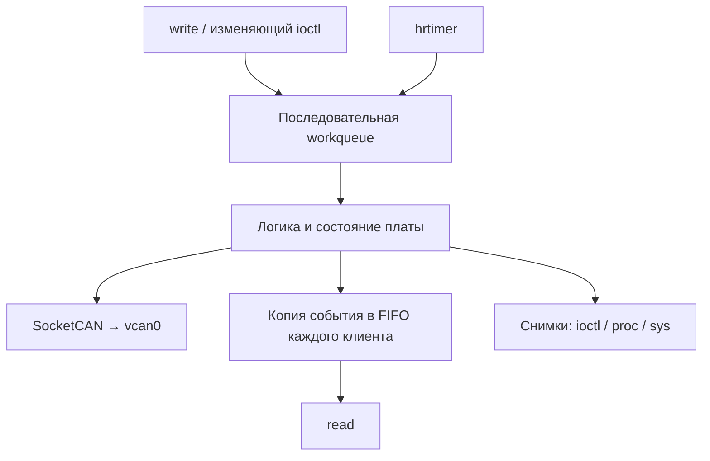

# Отчёт о разработке Virtual Board

**Проект:** виртуальная CAN-плата температурного контроля.  
**Курс:** разработка ядра Linux, уровень Medium.  
**Состояние на 17.09.2026:** проектирование и подготовка среды; модуль ещё не реализован.

Отчёт пополняется после завершённых смысловых блоков. Принятые решения, написанный код и подтверждённые испытания отмечаются отдельно. Инструкции использования находятся в [README](../README.md), спецификация — в [PROTOCOL.md](PROTOCOL.md).

## 1. Задача и требования

Цель — разработать модуль ядра Linux, эмулирующий плату температурного контроля. Пользователь задаёт температуру и пределы, модуль определяет температурное состояние и передаёт статус через SocketCAN. Виртуальная шина позволяет выполнять проверки без физического CAN-адаптера.

Ключевое требование Medium — персональный буфер каждого процесса. Чтение одним процессом не должно забирать события у другого. Состояние платы при этом остаётся общим.

| Требование | Проектное решение | Состояние |
| --- | --- | --- |
| read, write, ioctl | Символьное устройство `/dev/virtual_board` | Спецификация, обработчиков нет |
| Персональные буферы | Контекст процесса и отдельный kfifo | Архитектура; детали владения ещё уточняются |
| Интерфейсы /dev, /proc, /sys | Устройство, сводка и атрибуты состояния | Запланировано |
| Обработка ошибок и освобождение | Проверка ввода, откат init, остановка работ, парное освобождение | Запланировано |
| Makefile с загрузкой и выгрузкой | Makefile и Kbuild | Сборка, загрузка и выгрузка минимального модуля проверены 18.09 |
| Пользовательские проверки | boardctl на C, shell-команды, can-utils | Проверена только виртуальная шина |
| Документация и история разработки | README, протокол, отчёт, Git | Создан начальный коммит `422f1eb` |
| Среда курса и .config | Работа на текущем Linux Mint по решению пользователя | Конфигурация в репозиторий пока не добавлена |

Исходное задание также содержит требование образа и ядра курса, собранного и оптимизированного согласно ДЗ №1. Соответствие текущего дистрибутивного ядра этой формулировке не подтверждено. Работу с конфигурацией пользователь отложил; пересборка и переустановка не выполнялись.

## 2. Архитектура и решения курса

### 2.1. Разделение ответственности

Выбран один модуль `virtual_board.ko`, общий контекст платы и отдельные файлы по назначению.

| Файл | Ответственность |
| --- | --- |
| `src/main.c`, `src/board.h` | Жизненный цикл и внутренние структуры |
| `src/params.c`, `src/board.c` | Параметры, проверка значений и логика платы |
| `src/worker.c` | hrtimer и одна последовательная workqueue |
| `src/chardev.c` | Регистрация устройства и файловые операции |
| `src/clients.c` | Контексты процессов, очереди и доставка событий |
| `src/can.c` | CAN-сокет, упаковка и отправка кадров |
| `src/proc.c`, `src/sysfs.c` | Наблюдение за состоянием |
| `include/virtual_board_uapi.h` | Общий интерфейс ioctl |
| `tools/boardctl.c` | Пользовательская утилита |

Это распределение ответственности. Подготовлены UAPI, main.c, параметры с проверками в params.c и резервирование номера в chardev.c. board.h содержит контекст и объявления; обработчики устройства ещё не реализованы.

### 2.2. Поток обработки



Команды копируются в память ядра до передачи worker. Таймер только назначает периодическую работу; отправка выполняется worker. Читатель ожидает данные вне workqueue, чтобы не блокировать обработку команд и CAN-передачу. Периодические CAN-статусы не заполняют персональные FIFO.

### 2.2.1. Подготовка шины, отправка кадров и чтение событий

Проект разделяет подготовку виртуальной сети, работу эмулируемой платы и наблюдение за результатами.

| Компонент | Роль |
| --- | --- |
| Драйвер ядра `vcan` | Обеспечивает работу виртуального CAN-интерфейса |
| Команды `ip link add` и `ip link set` | Создают `vcan0` и включают его до работы платы |
| Наш модуль `virtual_board` | Хранит температуру и состояния, формирует CAN-кадры и отправляет их через SocketCAN |
| Команды записи в `/dev/virtual_board` и будущая утилита `boardctl` | Передают модулю настройки и команды управления |
| `candump` | Принимает и показывает CAN-кадры |
| `read()` устройства `/dev/virtual_board` | Возвращает локальные события из персонального FIFO процесса |

Параметр загрузки `can_iface` задаёт имя уже подготовленного интерфейса, по умолчанию `vcan0`. Сохранение этой строки не создаёт интерфейс и не открывает сокет. Будущая CAN-часть модуля проверит выбранный интерфейс, создаст CAN-сокет ядра и привяжет его к интерфейсу для отправки. Модуль не принимает управляющие CAN-кадры. При выгрузке он освобождает собственный сокет; созданный отдельно `vcan0` остаётся.

Пользователь управляет платой из терминала, но CAN-кадры в целевом сценарии формирует и отправляет сам модуль: периодический статус — при running, температурное уведомление — при переходе temp_status в running. Команда `cansend` использовалась только для предварительной проверки среды и не заменяет отправку из модуля.

```text
Подготовка: vcan + ip link → готовый интерфейс vcan0

Управление: терминал / boardctl → write / ioctl → virtual_board
Передача:  virtual_board → CAN-сокет → vcan0 → candump
События:   virtual_board → FIFO каждого процесса → read()
```

CAN-приём в `candump` и чтение персональных событий устройства — два разных пути. Периодические статусы CAN не добавляются в FIFO; работа CAN не зависит от наличия читателей устройства.

**Статус на 18.09.2026:** эта схема фиксирует согласованное устройство проекта и основу объяснения на защите. Проверены отдельно обмен через vcan стандартными утилитами и жизненный цикл минимального модуля. Параметр `can_iface` реализован; подтверждены сборка, метаданные и чтение начального и переданного значений через sysfs; отправка из модуля, управление и персональные очереди пока не реализованы.

### 2.3. Основа из курса

| Материал | Выбранное решение | Статус применения |
| --- | --- | --- |
| ДЗ22, producer–consumer | Общий контекст, разбиение файлов, hrtimer → workqueue | Выбрано для реализации |
| ДЗ14, сетевой модуль | Сокеты ядра и alloc_ordered_workqueue | Выбрано; CAN требует адаптации |
| ДЗ11, FIFO | kfifo с ограниченной ёмкостью | Выбрано для реализации |
| ДЗ10 и ДЗ18 | Список клиентов и mutex | Выбрано для реализации |
| Лекция 16 | Идентичность процесса и ссылки на PID | Правила владения ещё уточняются |
| Лекция 31, chardev-demo | cdev, файловые операции, usercopy, completion | Выбрано для реализации |
| Лекция 33 | ioctl, procfs и sysfs | Начат общий UAPI |

Подробный рабочий справочник хранится отдельно от репозитория кода. В итоговом отчёте останутся решения, фактически использованные и проверенные в модуле.

### 2.4. Принятые параметры

Температура хранится знаковым целым в десятых долях °C, диапазон −40,0…+125,0 °C. Начальное значение — 25,0 °C, пределы — 10,0–70,0 °C. Период CAN по умолчанию 100 мс, допустимый диапазон 10–60 000 мс. Предусмотрены до 8 процессов и 64 события в каждой очереди.

Рабочее состояние `stopped/running` независимо от температурного `normal/undertemp/overheat`. Границы входят в нормальный диапазон. Температурная авария не останавливает передачу, возврат в норму не требует ручного подтверждения.

Для статуса выбран CAN ID `0x123`, для температурного перехода — `0x124`. Формат восьмибайтовой нагрузки и примеры приведены в [протоколе](PROTOCOL.md). Пользователь принял эти параметры; проверок реализации пока нет.

## 3. Среда разработки

| Компонент | Проверенное значение |
| --- | --- |
| ОС и архитектура | Linux Mint 22, x86_64 |
| Запущенное ядро | `6.8.0-38-generic` |
| Заголовки | Каталог `/lib/modules/6.8.0-38-generic/build` доступен |
| Компилятор и make | GCC 13.2.0, GNU Make 4.3 |
| CAN-инструменты | ip, cansend, candump |
| Конфигурация CAN | CAN, CAN_RAW, CAN_VCAN предусмотрены модулями |
| Интерфейс для испытаний | `vcan0`, создан и включён пользователем |

Конфигурация ядра не менялась. Наличие инструментов и заголовков не считается подтверждением сборки или загрузки нашего модуля. Системные команды, сборку и загрузку выполняет пользователь; ассистент объясняет действия и анализирует результаты.

## 4. Реализация: разобранные блоки

### 4.1. Назначение UAPI и структура пределов

**Статус:** общий заголовок подготовлен, назначение структуры `vb_limits` разобрано; обработчик ioctl отсутствует. Определения SET_LIMITS, SET_PERIOD и GET_STATUS также разобраны; реализации обработчиков нет.

Модуль и boardctl собираются отдельно, поэтому им нужен одинаковый формат данных. Структура `vb_limits` содержит два поля типа `__s32` из `<linux/types.h>`: `low_decic` и `high_decic`. Знаковый тип позволяет передавать отрицательные температуры; фиксированная ширина задаёт одинаковый размер полей для обеих сторон.

Объявление структуры не выделяет память. В будущем boardctl создаст переменную этого типа, запишет пределы и передаст её адрес в ioctl. Обработчик модуля скопирует значения из пользовательской памяти в отдельный объект ядра, проверит оба предела и применит их одной операцией. Сохранение пользовательского адреса не заменяет копирования данных и не даёт worker права использовать этот адрес позже.

Разобраны команды SET_LIMITS и SET_PERIOD: макрос `_IOW` кодирует семейство, номер операции и размер типа аргумента. Он не выполняет копирование и проверку значений; это обязанности будущего обработчика. Для периода определено поведение в stopped и running.

### 4.2. Группировка состояний

Пользователь заменил отдельные макросы состояний перечислениями `enum vb_state` и `enum vb_temp_status`. Коды заданы явно и сохранены без изменений. В передаваемой структуре vb_status поля state и temp_status остаются `__u32`: именованные значения сгруппированы, размер внешнего интерфейса фиксирован независимо от размера enum. Замена проверена чтением исходника; новая сборка не выполнялась.

### 4.3. Получение состояния и согласованный снимок

Разобран GET_STATUS: `_IOR` кодирует передачу результата из ядра пользователю. Пользовательская программа предоставляет адрес структуры vb_status. Будущий обработчик под mutex платы скопирует поля в локальную структуру ядра, отпустит mutex и затем скопирует снимок пользователю. Все поля относятся к одному состоянию платы; ожидание пользовательской памяти не удерживает mutex платы. GET_STATUS не изменяет плату и не извлекает события из FIFO.

### 4.4. Подготовка сборки и проверки оформления

Пользователь перенёс знакомый Makefile и адаптировал цели к virtual_board. Цели format/check охватывают src, include и tools; check дополнительно проверяет Makefile и Kbuild. Обнаружено, что установленный checkpatch завершает весь процесс на первом пустом файле. Поэтому цель check перебирает файлы, пропускает пустые и запускает отдельную проверку каждого непустого файла, сохраняя общий ненулевой результат при замечаниях.

Пользователь добавил Kbuild:

```makefile
obj-m += virtual_board.o
virtual_board-y := src/main.o
```

Первая строка задаёт загружаемый модуль virtual_board.ko; вторая — его текущий состав. Суффикс -y здесь перечисляет объекты составного модуля и не меняет его на встроенный. Makefile передаёт системе сборки ядра каталог внешнего модуля через M=$(CURDIR), после чего та использует Kbuild. На момент добавления Kbuild main.c был пуст; последующая реализация описана в разделе 4.5.

### 4.5. Минимальный жизненный цикл модуля

18.09.2026 пользователь добавил `src/main.c`: функции `vb_init()` и `vb_exit()`, их связь с загрузкой и выгрузкой через `module_init/module_exit`, сообщения `pr_info` и метаданные с `MODULE_LICENSE("GPL")`. Разобраны роль отметок `__init/__exit` и необходимость освобождать полученные ресурсы внутри init при ошибке: exit не вызывается автоматически для отката.

Проверены актуальный код и подключение `src/main.o` в Kbuild. На этом этапе модуль только пишет сообщения; память, устройство, таймеры и работы не создаются. Проверка `git diff --check` обнаружила пробелы перед табуляцией в main.c и Makefile. После форматирования пользователь проверил сборку, загрузку и выгрузку; результаты приведены в разделах 5.4–5.5.

### 4.6. Строковый параметр CAN-интерфейса

В params.c добавлен массив `char can_iface[IFNAMSIZ] = "vcan0"`, описание `module_param_string(can_iface, can_iface, sizeof(can_iface), 0444)` и `MODULE_PARM_DESC`. Kbuild включает src/main.o и src/params.o в один модуль. Подход основан на параметрах ДЗ22; для имени выбран готовый строковый обработчик ядра с ограниченным размером массива.

Массив хранит одно имя интерфейса: до 15 байт и завершающий ноль. Это не список интерфейсов. Описание параметра сохраняет адрес массива, его размер и связь с обработчиками. При загрузке ядро разбирает аргументы и записывает переданную строку в массив до вызова vb_init; без аргумента сохраняется начальное значение.

Файл `/sys/module/virtual_board/parameters/can_iface` предоставляет доступ к значению в памяти через обработчик ядра. Sysfs — виртуальная файловая система, а не отдельный раздел виртуальной памяти или дисковое хранилище строки. Код модуля сможет обращаться к массиву напрямую. Права 0444 разрешают чтение владельцу, группе и остальным; запись через sysfs запрещена, но передача аргумента загрузки разрешена.

`modinfo -p` показывает описание и тип параметра из файла .ko. Упоминание default в MODULE_PARM_DESC — поясняющий текст; фактическое начальное значение задаёт инициализатор массива. В params.c реализована наша функция `vb_validate_params()`, объявленная в board.h. Она вызывает готовую `dev_valid_name()` из `<linux/netdevice.h>`. Объявление и экспорт символа подтверждены в заголовках и Module.symvers целевого ядра 6.8.0-38-generic. Вызов проверяет допустимость строки имени, но не существование или тип интерфейса. Поиск интерфейса и открытие сокета ещё не реализованы.

В начале vb_init результат проверки сохраняется в ret. При ошибке наша функция пишет сообщение через pr_err и возвращает -EINVAL; vb_init передаёт эту ошибку ядру до сообщения об успешной загрузке. При успехе возвращается 0. Проверка следует подходу ДЗ22: прекращается на первом несоответствии. Ресурсы пока не создаются, откат не требуется; при неудачном init ядро не вызывает exit. Код завершения insmod (в тесте 1) отличается от отрицательного кода ошибки модуля; Bash предоставляет результат последней команды через `$?`.

### 4.7. Числовые параметры начального состояния

В params.c добавлены `int temperature_decic=250`, `int low_decic=100`, `int high_decic=700` и `unsigned int period_ms=100`. Каждый зарегистрирован через module_param с правами 0444. Готовый обработчик ядра преобразует текст аргумента в int/uint до вызова init; наши прикладные ограничения проверяет vb_validate_params.

Температура и пределы хранятся целыми числами в десятых долях °C: 253 означает 25,3 °C. float и double не используются. Тип int выбран для обработчика параметра загрузки; фиксированные типы __s32/__u32 в UAPI не меняются. Параметры задают начальные настройки; рабочий контекст платы ещё не реализован.

В board.h вынесены общие константы: температура −400…1250, период 10…60000 мс. Температурные константы знаковые; суффикс U используется только для периода, чтобы не превращать отрицательные температуры в беззнаковые значения при сравнении.

Проверка последовательно отклоняет выход температуры или каждого предела за диапазон с -ERANGE, равные/переставленные пределы с -EINVAL, период вне диапазона с -ERANGE. Границы включены. Температура вне настроенного интервала low…high допускается, если входит в общий диапазон платы: это сценарий температурной аварии. В текущем коде классификация temp_status ещё не реализована. Как в ДЗ22, после первой ошибки функция сразу возвращает код; init передаёт его ядру.

### 4.8. Контекст платы и резервирование номера устройства

В board.h описан struct board_ctx: devno хранит номер major/minor, встроенный cdev предназначен для связи номера с файловыми операциями, указатели class и device — для адресов будущих объектов модели устройств ядра. Объект device не является файлом в /dev. Определение единственного экземпляра `struct board_ctx board` находится в main.c; `extern` в board.h позволяет другим исходникам обращаться к нему без создания копий. Контекст существует в памяти загруженного модуля, исходные поля обнулены. Объекты class/device пока не создаются.

В chardev.c реализованы наши vb_chardev_init/exit. Первая вызывает `alloc_chrdev_region(&board.devno, 0, 1, "virtual_board")`: ядро резервирует один номер с minor 0, выбирает major и записывает полученный dev_t по переданному адресу. Запись о резервировании остаётся в ядре после возврата функции. Это ещё не регистрация обработчиков или создание /dev.

При ошибке код возвращается через vb_init; после успешного резервирования в текущей реализации больше нет операций, которые могут завершиться ошибкой. При выгрузке vb_exit вызывает vb_chardev_exit, а та — `unregister_chrdev_region(board.devno, 1)`. Эта функция снимает резервирование того же диапазона. Получение ресурса и его освобождение основаны на примере democh.c лекции 31. Kbuild включает main.o, params.o и chardev.o.

### 4.9. Регистрация cdev, класса и устройства

В chardev.c добавлена таблица vb_fops типа struct file_operations. Пока заполнено только owner=THIS_MODULE: это указатель на объект модуля, не номер major. Обработчики read/write/ioctl ещё не назначены. cdev_init подготавливает встроенный board.cdev и сохраняет адрес таблицы, cdev_add регистрирует связь с board.devno; владелец cdev также установлен в THIS_MODULE.

class_create создаёт объект класса virtual_board; на целевом ядре используется сигнатура с одним аргументом. device_create получает класс, NULL в качестве родителя, devno, адрес board как данные устройства и имя virtual_board. Он регистрирует объект устройства; devtmpfs создаёт соответствующий узел /dev, udev может настраивать права. Адрес board сохраняется, контекст при этом не копируется.

Возвраты class_create/device_create проверяются через IS_ERR, код ошибки извлекается PTR_ERR. Метки отката удаляют только успешно зарегистрированные ранее ресурсы: ошибка cdev_add освобождает номер; ошибка класса удаляет cdev и номер; ошибка устройства дополнительно удаляет класс. При обычной выгрузке порядок: device_destroy → class_destroy → cdev_del → unregister_chrdev_region. Ветви ошибок проверены чтением кода, искусственные отказы регистрации не испытывались.

Разобрано различие путей: `/sys/module/virtual_board/parameters/` связан с переменными параметров через module_param и не использует devno; `/sys/class/virtual_board/virtual_board/dev` показывает номер устройства, совпадающий с номером узла `/dev/virtual_board`. Эти два назначения sysfs не смешиваем.

## 5. Испытания

### 5.1. Подготовка vcan0 и проверка обмена

**Дата:** 17.09.2026. **Исполнитель:** пользователь. **Основание:** предоставленный вывод терминалов.

Перед созданием проверяем существующие интерфейсы:

```bash
ip -details link show type vcan
```

Если vcan0 отсутствует:

```bash
sudo modprobe vcan
sudo ip link add dev vcan0 type vcan
```

Включение и проверка:

```bash
sudo ip link set dev vcan0 up
ip -details link show vcan0
```

Фактически получено: интерфейс `vcan0`, флаги `UP,LOWER_UP`, тип `vcan`, `state UNKNOWN`. Затем в первом терминале запущен приём:

```bash
candump vcan0
```

Во втором терминале отправлен кадр:

```bash
cansend vcan0 123#11223344
```

Ожидаемый и фактический результат совпали:

```text
vcan0  123   [4]  11 22 33 44
```

**Вывод:** обмен через виртуальную CAN-шину стандартными утилитами работает. Это не испытание модуля Virtual Board и не проверка его восьмибайтового протокола.

Для повторения теста после перезагрузки сначала проверяем наличие интерфейса; существующий заново не создаём. Физический can0 от USB–CAN-адаптера для этого сценария не требуется. Скорость bitrate не задаём. При недоступности протокола CAN RAW можно загрузить `sudo modprobe can_raw`. Приём останавливается через Ctrl+C.

### 5.2. Предварительные проверки спецификации и заголовка

До принятия правил самостоятельной сборки студентом ассистент выполнил проверку заголовка для userspace с GCC: `-std=c11 -Wall -Wextra -Werror -fsyntax-only`. Статические утверждения подтвердили размеры `vb_limits` — 8 байт, `vb_period` — 4 байта, `vb_status` — 24 байта, смещение последнего поля и размер/направление выбранных ioctl-команд. Проверка завершилась без ошибок. Постоянный тестовый файл в репозиторий не добавлялся.

Отдельно арифметически проверены три примера CAN-нагрузки из протокола: 25,0 °C, 85,0 °C и −5,0 °C. Это проверка примеров кодирования, а не передача этих кадров модулем.

### 5.3. Проверка оформления

Пользователь выполнил make format и make check. После исправления завершающей табуляции в Makefile последний предоставленный результат: 0 ошибок, одно предупреждение для UAPI (нет SPDX-License-Identifier), одно для Makefile (имя файла внутри списка проверяемых файлов). Предупреждения оставлены явно: лицензия пока не выбрана, упоминание Makefile необходимо для проверки самого файла. Цель завершилась кодом 1, поэтому полностью чистая проверка не заявляется.

Этот результат получен до заполнения Kbuild. После добавления Kbuild повторный результат ещё не предоставлен. Проверки форматирования не заменяют сборку и испытания модуля.

### 5.4. Первая сборка минимального модуля

18.09.2026 пользователь выполнил `make format` и `make`. По предоставленному выводу сборка для `6.8.0-38-generic` завершилась созданием `virtual_board.ko`, без ошибок компиляции и компоновки. Предупреждение о компиляторе показывает разные имена (`x86_64-linux-gnu-gcc-13` и `gcc-13`) при одинаковой указанной версии Ubuntu GCC 13.2.0-23ubuntu4. Генерация BTF пропущена из-за отсутствия vmlinux; файл модуля собран.

Перед следующим шагом актуальный main.c повторно проверен: отступы исправлены, init возвращает 0, exit только пишет сообщение, выделений ресурсов, таймеров и отложенной работы нет. Результаты последующей загрузки и выгрузки приведены ниже.

### 5.5. Загрузка и выгрузка минимального модуля

18.09.2026 пользователь выполнил `make load` и `sudo dmesg | tail -n 20`, затем `make unload` и `sudo dmesg | tail -n 5`. Цели вызвали `sudo insmod ./virtual_board.ko` и `sudo rmmod virtual_board`; ошибок команд в предоставленном выводе нет. Журнал подтвердил обе функции:

```text
[354861.230190] virtual_board: module loaded
[355058.244329] virtual_board: module unloaded
```

Первый цикл сборки, загрузки и выгрузки подтверждён на текущем ядре. Модуль выгружен. Это проверка минимального жизненного цикла: устройство, параметры, обработчики, очереди и CAN-передача ещё отсутствуют; освобождение будущих ресурсов и откаты ошибок пока не испытывались.

### 5.6. Подготовка материалов защиты

18.09.2026 по согласованию с пользователем подготовлена [рабочая презентация](presentation/README.md): восемь слайдов в ODP, PPTX и PDF, а также отдельные заметки для выступления. Показаны задача, распределение ролей, персональные FIFO, два состояния, решения курса и подтверждённые результаты минимального модуля. Планируемые возможности явно отделены от проверенных. Презентацию дополняем после завершённых блоков; итоговую версию и сценарий демонстрации готовим после испытаний и уточнения регламента защиты.

### 5.7. Проверка параметра can_iface

18.09.2026 пользователь выполнил `make format && make`. В выводе подтверждены компиляция src/params.o и сборка virtual_board.ko. Команда `modinfo -p ./virtual_board.ko` вывела:

```text
can_iface:CAN interface name (default: vcan0) (string)
```

После `make load` чтение `cat /sys/module/virtual_board/parameters/can_iface` вернуло `vcan0`. Затем выполнены:

```bash
make unload
sudo insmod ./virtual_board.ko can_iface=vcan1
cat /sys/module/virtual_board/parameters/can_iface
```

Фактический результат — `vcan1`. Подтверждены начальное значение, передача строки при загрузке и чтение через sysfs. Наличие vcan1 для этой проверки не требуется: модуль пока не ищет интерфейс. Отказ записи через sysfs и отклонение слишком длинной строки отдельно не испытывались. После проверки пользователь выполнил make unload; команда sudo rmmod virtual_board завершилась без ошибки. Модуль выгружен.

### 5.8. Отказ при неверном имени и успешная загрузка

18.09.2026 после подключения проверки пользователь выполнил make format и make; сборка main.o, params.o и virtual_board.ko завершилась успешно. Актуальные исходники проверены перед испытаниями.

Отрицательный сценарий:

```bash
sudo insmod ./virtual_board.ko can_iface=bad/name
echo "Код завершения insmod: $?"
sudo dmesg | tail -n 5
lsmod | grep '^virtual_board '
```

Фактически insmod сообщил Invalid parameters и вернул код 1, журнал содержал `virtual_board: invalid CAN interface name`, а поиск в lsmod не вывел строк. Модуль не загрузился.

Контрольный сценарий:

```bash
sudo insmod ./virtual_board.ko can_iface=vcan0
cat /sys/module/virtual_board/parameters/can_iface
lsmod | grep '^virtual_board '
make unload
sudo dmesg | grep 'virtual_board:' | tail -n 3
```

Получены значение `vcan0` и строка `virtual_board 12288 0` в lsmod. Выгрузка завершилась без ошибки. Журнал подтвердил последовательность:

```text
[361207.423598] virtual_board: invalid CAN interface name
[361484.999192] virtual_board: module loaded
[361485.028501] virtual_board: module unloaded
```

Подтверждены отказ при имени со слешем, успешная загрузка с допустимым именем после отказа и последующая выгрузка. Сейчас модуль выгружен. Остальные классы недопустимых имён отдельно не испытывались; эти тесты не подтверждают поиск или подключение CAN-интерфейса.

### 5.9. Числовые параметры: приём границ и отказы

18.09.2026 пользователь успешно выполнил make format и make после добавления параметров и проверки. Актуальные исходники прочитаны перед испытаниями.

Допустимый набор:

```bash
sudo insmod ./virtual_board.ko temperature_decic=-400 low_decic=-400 high_decic=1250 period_ms=10
cat /sys/module/virtual_board/parameters/temperature_decic
cat /sys/module/virtual_board/parameters/low_decic
cat /sys/module/virtual_board/parameters/high_decic
cat /sys/module/virtual_board/parameters/period_ms
make unload
```

Прочитаны по порядку -400, -400, 1250, 10; загрузка и последующая выгрузка прошли без ошибки. Подтверждены отрицательная температура, нижние границы температуры/нижнего предела, верхняя граница верхнего предела и минимальный период. Период пока только хранится, таймера нет.

Затем выполнены пять отдельных попыток insmod с одним неверным параметром или парой пределов. После каждой пользователь проверил `$?`; во всех случаях получен код 1.

| Аргументы загрузки | Сообщение нашего модуля | Результат insmod |
| --- | --- | --- |
| temperature_decic=1251 | temperature_decic is out of range | Numerical result out of range |
| low_decic=-401 | low_decic is out of range | Numerical result out of range |
| high_decic=1251 | high_decic is out of range | Numerical result out of range |
| low_decic=700 high_decic=100 | low_decic must be less than high_decic | Invalid parameters |
| period_ms=9 | period_ms is out of range | Numerical result out of range |

После серии `sudo dmesg | grep 'virtual_board:' | tail -n 5` показала пять соответствующих сообщений с отметками 369031.220059–369100.474372. Команда `lsmod | grep '^virtual_board '` ничего не вывела: модуль не загружен.

Проверены все пять ветвей числового отказа на перечисленных примерах. Не заявляем полный перебор границ: в частности, равные пределы, максимальный период и превышение максимального периода отдельно не испытывались. Проверки рабочей температурной логики, write/ioctl и CAN ещё впереди.

### 5.10. Резервирование и освобождение номера

18.09.2026 пользователь успешно собрал модуль после подключения chardev.o и вызовов из main.c. Перед предложением загрузки актуальные init, exit, параметры и реализация резервирования проверены чтением.

```bash
make load
sudo dmesg | grep 'virtual_board:' | tail -n 2
grep -w virtual_board /proc/devices
make unload
grep -w virtual_board /proc/devices
sudo dmesg | grep 'virtual_board:' | tail -n 1
```

При загрузке получены:

```text
[371930.470722] virtual_board: reserved device number 511:0
[371930.470732] virtual_board: module loaded
511 virtual_board
```

После успешного rmmod поиск в /proc/devices ничего не вывел. Последнее сообщение журнала:

```text
[371958.563407] virtual_board: module unloaded
```

Подтверждены резервирование номера 511:0 и удаление регистрации при выгрузке. Major выделяется динамически и не обязан сохраняться при следующих загрузках. Ошибка самого alloc_chrdev_region искусственно не вызывалась. /proc/devices — штатный список ядра, не наш будущий /proc/virtual_board. cdev, класс, объект устройства и узел /dev/virtual_board ещё не зарегистрированы. Модуль выгружен.

### 5.11. Создание и удаление узла /dev и класса

18.09.2026 сборка после добавления cdev, класса и устройства завершилась успешно. Перед загрузкой актуальные исходники init/exit и откаты проверены чтением.

```bash
make load
ls -l /dev/virtual_board
cat /sys/class/virtual_board/virtual_board/dev
sudo dmesg | grep 'virtual_board:' | tail -n 2
```

Фактически получены `crw------- 1 root root 511, 0 ... /dev/virtual_board`, значение `511:0` в sysfs и сообщения журнала:

```text
[373840.617796] virtual_board: reserved device number 511:0
[373840.618019] virtual_board: module loaded
```

Узел символьный, его номер совпадает с номером в sysfs и журнале; права узла 0600, владелец и группа root. Это отдельно от прав 0444 файлов параметров.

```bash
make unload
ls -ld /dev/virtual_board /sys/class/virtual_board
grep -w virtual_board /proc/devices
sudo dmesg | grep 'virtual_board:' | tail -n 1
```

rmmod завершился без ошибки; ls сообщил об отсутствии обоих путей, grep не вывел строк. Журнал: `[374164.331818] virtual_board: module unloaded`. Удаление узла, класса и записи номера подтверждено. Модуль выгружен. Приём команд, чтение событий, ioctl и пользовательские атрибуты состояния ещё не реализованы; проверка узла не считается проверкой этих операций.

### 5.12. Подготовка приёма команд — без испытаний

К концу сессии 18.09 добавлены рабочее состояние платы и его инициализация, копирование и разбор текстовой команды, применение temp/limits с проверкой диапазонов и пересчётом температурного статуса. Изменение выполняется через локальную копию: при ошибке общий статус остаётся прежним. Mutex состояния освобождается на всех путях. start/stop пока явно отклоняются с -EOPNOTSUPP, поскольку управление передачей не подключено.

В общем контексте объявлены command_lock и указатель wq. Это только подготовка: очередь не создана, новая блокировка не инициализирована. Workqueue предназначена для последовательного выполнения команд и будущих периодических работ; она не заменяет персональные FIFO событий. Основа следующего блока — workqueue/completion из примера символьного устройства курса и ordered workqueue из сетевого примера; время жизни запроса и очистку необходимо проверить отдельно.

Исходники просмотрены, но после этих изменений пользователь ещё не выполнял сборку и загрузку. Обработчик write отсутствует, вспомогательные функции разбора не подключены. Поэтому приём команд и температурная логика не считаются проверенными. Последний подтверждённый результат — раздел 5.11.

### 5.13. Соединение write и очереди работ — 21.09

Студент подключил ordered workqueue в worker.c, main.c и Kbuild. Очередь создаётся до регистрации устройства; при ошибке регистрации её освобождает откат init, при штатной выгрузке — exit после удаления регистрации устройства.

Один вызов write копирует и разбирает полную команду, затем вызывает vb_submit_command. Отправитель берёт command_lock, выделяет память под board_request через kmalloc и записывает туда копию команды. INIT_WORK сохраняет адрес vb_command_work, queue_work ставит работу в очередь, а wait_for_completion ожидает результат. Рабочий обработчик получает адрес заявки через container_of, вызывает vb_board_apply_command, записывает результат и вызывает complete как последнее обращение к заявке. Отправитель читает результат, освобождает память и отпускает command_lock. Рабочий обработчик этот mutex не берёт; state_lock используется внутри функции изменения состояния.

Нулевой write возвращает 0; ошибки копирования и разбора не создают заявку. Успешное выполнение возвращает исходное число байтов, ошибка — отрицательный код. temp/limits применяются к копии состояния с сохранением только при успехе; start/stop пока возвращают -EOPNOTSUPP. Персональные FIFO и CAN этим блоком не реализованы.

21.09 пользователь выполнил make format && make. Скомпилированы main.o, params.o, chardev.o, board.o и worker.o, создан virtual_board.ko для 6.8.0-38-generic. Ошибок компиляции и компоновки в выводе нет. Предупреждение о компиляторе показывает разные имена при одинаковой версии GCC 13.2.0-23ubuntu4; генерация BTF пропущена из-за отсутствия vmlinux.

Затем make check сообщил суммарно 0 ошибок и 17 предупреждений: семь отсутствующих SPDX-тегов, три замечания к многострочным комментариям, шесть к отступам MODULE_PARM_DESC и одно к упоминанию Makefile в проверяемом файле. Цель завершилась кодом 1; чистая проверка стиля не заявляется. Настройки clang-format не обеспечили полного соответствия checkpatch. Выбор SPDX остаётся отдельным нерешённым пунктом, предупреждения не подавлялись.

После форматирования исходники повторно просмотрены: проверены границы буфера, возвраты ошибок, порядок инициализации, освобождение заявки и блокировок. git diff --check завершился без замечаний. Пользователь затем подтвердил загрузку и первое выполнение temp 300: команда sudo sh -c 'printf "temp 300\n" > /dev/virtual_board' завершилась с кодом 0. Журнал содержит reserved device number 511:0 (5764.633512), module loaded (5764.633708) и temp=300 low=100 high=700 temp_status=0 (5792.366623). Подтверждён первый проход write → workqueue → изменение состояния → возврат результата. В журнале также есть сообщение об отсутствии подписи/ключа модуля; загрузка состоялась. Дальнейшие испытания и завершение цикла приведены ниже.

| Команда через write | Код shell | Фактический результат |
| --- | --- | --- |
| `temp 300` | 0 | temp=300 low=100 high=700 temp_status=0 |
| `limits 100 250` | 0 | temp=300 low=100 high=250 temp_status=2 |
| `temp 250` | 0 | temp=250 low=100 high=250 temp_status=0 |
| `temp 99` | 0 | temp=99 low=100 high=250 temp_status=1 |
| `temp 1251` | 1 | printf сообщил I/O error |
| `limits 700 100` | 1 | printf сообщил I/O error |
| `temp 200 extra` | 1 | printf сообщил I/O error |
| `temp 99` после отказов | 0 | temp=99 low=100 high=250 temp_status=1 |
| `temp 100` | 0 | temp=100 low=100 high=250 temp_status=0 |

Команды выполнялись через `sudo sh -c 'printf "<команда>\n" > /dev/virtual_board'`, код shell проверялся сразу через `$?`, результат — по журналу ядра. Подтверждены пересчёт при смене пределов, переходы normal → overheat → normal → undertemp → normal, включение обоих точных пределов в норму и сохранение пределов после ошибочного limits. Точный errno системного write не измерялся: общее сообщение shell I/O error не доказывает возврат -EIO. Сохранение температуры сразу после ошибочных команд отдельно не наблюдалось: контрольная команда сама записывает 99. Целостность состояния при ошибке дополнительно проверена чтением реализации, но не считается полностью испытанной.

После команд пользователь выполнил make unload: sudo rmmod завершился без ошибки. ls сообщил об отсутствии /dev/virtual_board и /sys/class/virtual_board, grep -w virtual_board /proc/devices ничего не вывел. Журнал: `[6163.443558] virtual_board: module unloaded`. Подтверждён обычный цикл загрузки, команд и выгрузки версии с workqueue. Модуль выгружен.

Ограничения проверки: не испытывались отказ kmalloc/создания очереди, конкурентные записи, нулевая и длинная запись, встроенный NUL, многострочный ввод, точные errno и start/stop. Выгрузка без зависания не доказывает отсутствие всех утечек. CAN и персональные FIFO ещё не реализованы. Следующий блок — подключение CAN-интерфейса и первый кадр.

### 5.14. Подготовка CAN-сокета — 21.09

В can.c реализованы поиск интерфейса по can_iface через dev_get_by_name, проверка ARPHRD_CAN и получение ifindex с парным dev_put. vb_can_init создаёт CAN_RAW-сокет в init_net, задаёт пустой CAN_RAW_FILTER через protocol setsockopt с KERNEL_SOCKPTR(NULL), затем привязывает сокет через kernel_bind. При ошибке настройки или привязки сокет освобождается. Приём отключён только для сокета модуля; локальный loopback остаётся включённым для будущей проверки candump.

В main.c подключён порядок состояние → CAN → workqueue → устройство; откаты освобождают только успешно созданные ресурсы. При выгрузке очередь завершается до sock_release. can.o включён в Kbuild, can_sock и объявления добавлены в board.h. Модуль теперь требует существующего CAN-интерфейса при загрузке; успешный bind сам по себе не подтверждает поднятый интерфейс или отправку кадра.

Пользователь выполнил make format && make. Подтверждены компиляция can.o и создание virtual_board.ko для 6.8.0-38-generic без ошибок. Повторились сообщения о разных именах компилятора при одинаковой версии и пропуске BTF без vmlinux. После форматирования актуальные исходники, откаты и порядок завершения прочитаны; git diff --check без замечаний. Загрузка этой версии, отказы поиска/типа и освобождение сокета ещё не испытаны. Отправка CAN пока не реализована. Следующий шаг — проверить наличие vcan0, подготовить интерфейс при отсутствии и выполнить цикл загрузки/выгрузки силами пользователя.

21.09 пользователь создал vcan0 через modprobe vcan и ip link add, затем поднял интерфейс. Вывод ip подтвердил индекс 18, тип vcan, флаги UP/LOWER_UP. make load завершился успешно: узел /dev/virtual_board появился с правами 0600 root:root и номером 511:0, журнал module loaded (10337.360066). При текущем обязательном пути init это подтверждает успешные возвраты создания, настройки фильтра и привязки CAN-сокета; фактическое отсутствие приёма отдельно не измерялось, отправки ещё нет.

Затем make unload завершился без ошибки: узел и класс исчезли, запись номера отсутствует в /proc/devices, журнал module unloaded (10417.106987). vcan0 остался поднятым с индексом 18. Подтверждён обычный цикл версии с CAN-сокетом, но это не доказательство отсутствия всех утечек. Модуль выгружен. Следующий шаг — отказы для отсутствующего и не-CAN интерфейса, затем первый кадр.

Отрицательные проверки выбора интерфейса также выполнены. ip link show vb_missing подтвердил отсутствие имени. insmod can_iface=vb_missing вернул 1 и No such device, журнал: interface vb_missing not found (10517.035676). insmod can_iface=lo вернул 1 и Invalid parameters, журнал: interface lo is not CAN (10551.314344). После обеих попыток модуль отсутствовал в lsmod, номер — в /proc/devices, узел и класс не существовали. Это отказы до создания сокета; ошибки setsockopt/bind и поздние откаты искусственно не вызывались. Модуль выгружен, vcan0 по последней проверке поднят. Подготовка сокета проверена; далее — формирование и отправка первого кадра.

### 5.15. Первый CAN-кадр и остановка передачи — 21.09

Задача: соединить проверенный путь write → ordered workqueue с отправкой температурного перехода через SocketCAN. В can.c добавлены упаковка can_frame, общий отправитель и операции статуса 0x123 / уведомления 0x124. Полезная нагрузка — 8 байт по PROTOCOL.md: три знаковых 16-битных значения little-endian, temp_status и state. Объект кадра локальный, предварительно обнулён; kvec хранит его адрес и размер всей структуры. kernel_sendmsg получает MSG_DONTWAIT, отрицательная ошибка передаётся вызывающему коду, полный размер означает принятие стеком, а не доказательство доставки.

В board.c старый и новый temp_status сравниваются под state_lock до сохранения нового состояния. Уведомление нужно только при running и изменении temp_status. После освобождения mutex рабочий поток отправляет локальный снимок; последовательная очередь не позволяет следующей команде обогнать отправку. Ошибка CAN журналируется, уже применённая команда не откатывается и её успешный результат сохраняется. start/stop теперь меняют state; таймер пока отсутствует, поэтому полная семантика периодического запуска ещё не реализована.

Пользователь выполнил make format && make: модуль собран без ошибок. Затем make load, start и temp 850 завершились успешно на поднятом vcan0 (индекс 18). candump получил 124 [8] 52 03 64 00 BC 02 02 01: температура 850, пределы 100/700, перегрев, running. Это первый подтверждённый кадр самого модуля.

Команды temp 900 и temp 250 вернули 0. При сохранении перегрева отдельного кадра не добавилось; возврат в норму дал 124 [8] FA 00 64 00 BC 02 00 01. После stop и temp 850 обе команды вернули 0; журнал подтвердил temp=850 low=100 high=700 temp_status=2 (18512.815282). Пользователь отдельно подтвердил отсутствие новых кадров в работающем candump: stopped запрещает отправку, сохраняя локальный контроль.

make unload завершился успешно: /dev/virtual_board и /sys/class/virtual_board отсутствуют, grep в /proc/devices не вывел записи, журнал module unloaded (18627.596263). Модуль выгружен. Отправка 0x123, отрицательная температура в payload, переход через limits, повторные start/stop и сетевые ошибки этой версии отдельно не испытаны. Нового make check нет; прежние 17 предупреждений относятся к версии до CAN. Следующий блок — hrtimer и периодическая работа в общей очереди, с остановкой таймера до уничтожения очереди.

### 5.16. Таймер и периодический CAN-статус — 21.09

Задача: отправлять снимок платы 0x123 периодически в running. В board_ctx добавлены встроенные tx_timer, tx_work и интервал tx_interval. vb_worker_init подготавливает работу, переводит period_ms в ktime, инициализирует hrtimer на CLOCK_MONOTONIC и сохраняет callback; запуска при загрузке нет. start назначает первое срабатывание через интервал, повторный start сохраняет срок. Callback ставит tx_work в общую ordered workqueue, переносит срок через hrtimer_forward_now и возвращает HRTIMER_RESTART. Он не берёт mutex и не отправляет CAN. Worker получает согласованный снимок под state_lock и отправляет его только в running. Пропущенные периоды не воспроизводятся.

stop синхронно отменяет таймер и сохраняет stopped. Ожидающая работа проверяет состояние перед отправкой. Команды и периодическая работа выполняются последовательно; callback не ждёт state_lock, поэтому отмена из команды под этим mutex не образует взаимного ожидания. При завершении модуля hrtimer_cancel предшествует destroy_workqueue; сокет освобождается после завершения работ. Память встроенного таймера hrtimer_cancel не освобождает.

Пользователь выполнил make format && make: virtual_board.ko собран для 6.8.0-38-generic без ошибок. Версии GCC совпадают при разных именах, BTF пропущен без vmlinux. Актуальные исходники и пути освобождения просмотрены до предложения загрузки; git diff --check без замечаний.

После start пользователь предоставил повторяющиеся кадры `123 [8] FA 00 64 00 BC 02 00 01`. Подтверждена отправка статуса: 250 (25 °C), пределы 100/700 (10–70 °C), normal=0, running=1. Поля идут слева направо; в каждой двухбайтовой температуре младший байт первым: BC 02 означает 0x02BC=700. Журнал: module loaded (22331.175696), состояние после команды (22355.966606), module unloaded (22394.053378). make unload завершился без ошибки; в предоставленном фрагменте журнала ошибок virtual_board нет.

Проверка с period_ms=1000: пользователь подтвердил прекращение кадров после stop и возобновление после start при непрерывно работающем candump -t a vcan0. Первые метки 1789992910.447614 и 1789992911.447622 дают интервал 1,000008 с. Последний кадр до паузы — 1789992945.447622, первый после запуска — 1789992967.511155: между ними 22,063533 с (это промежуток между кадрами, не измерение длительности команды stop). После запуска снова наблюдается примерно один кадр в секунду с неизменным payload FA006400BC020001. Точный момент write не записан, поэтому задержка от start до первого кадра не измерена.

Завершающий stop вернул код shell 0; make unload завершился успешно. Журнал последнего цикла: module loaded (24486.635653), module unloaded (24630.858614). В предоставленном фрагменте ошибок virtual_board нет. Модуль выгружен. Ранее также подтверждена остановка передачи при периоде по умолчанию и выгрузка (24339.626877). Повторные start при running возвращали 0, но сохранение срока тогда не наблюдалось; повторный stop при stopped отдельно не подтверждён.

Ограничения: интервал 100 мс не измерен; совместная работа 0x123/0x124, повторные команды без смены состояния, конкуренция и ошибки CAN требуют дальнейших проверок. Новый make check не выполнялся. Выгрузка не доказывает отсутствие всех гонок и утечек.

## 6. Текущий итог и точка продолжения

Актуально после блока 5.16: подтверждены периодические кадры 0x123 с интервалом около 1 с, stop, повторный запуск и успешная выгрузка. Модуль выгружен. Далее — повторные start при running и stop при stopped, совместная работа статуса и переходов; затем FIFO/read. Изменения таймера и документы требуют коммита.


Актуально на 21.09: write/workqueue, температурный контроль, CAN-сокет и первый кадр 0x124 испытаны (5.13–5.15). Подтверждены отсутствие повторов при прежнем temp_status, возврат в норму, запрет отправки в stopped и выгрузка. Модуль выгружен. Далее — таймер и периодический статус 0x123; затем FIFO/read, ioctl и атрибуты состояния. Политика восстановления CAN ещё открыта. Перед завершением дня сделать коммит; самостоятельно коммит и push не выполнялись.

### Предыдущий итог 18.09

Подготовлены архитектура, структура репозитория, спецификация, общий UAPI, Makefile и Kbuild. Подтверждены работа vcan0, сборка, загрузка и выгрузка минимального модуля с init/exit. boardctl и обработчики интерфейсов ещё не реализованы.

Точка продолжения 18.09.2026: завершён блок can_iface: хранение, чтение и проверка допустимости имени, отказ и успешная загрузка проверены. Модуль выгружен. Числовые параметры также добавлены и проверены: допустимый набор с отрицательной температурой и пять ветвей отказа, см. 5.9. Созданы общий контекст board и функции резервирования номера; получение 511:0 и удаление записи из /proc/devices после выгрузки проверены (5.10). Регистрация cdev, класса и устройства завершена; появление /dev/virtual_board с номером 511:0 и удаление узла, класса и номера после выгрузки проверены (5.11). Далее — минимальный write и первый CAN-кадр. UAPI, включая GET_STATUS, уже разобран. Код добавляется студентом небольшими функциональными блоками. Правила наследования дескрипторов, детали владения FIFO и восстановление после ошибок CAN остаются открытыми.

После каждого завершённого блока в соответствующей главе фиксируются его назначение, использованные API, принятые решения, подтверждённые проверки и оставшиеся ограничения. Перед сдачей отчёт редактируется в цельное описание реализованного проекта.

По поручению пользователя исходники и документы подготовлены к локальному коммиту состояния на конец 18.09. В снимок входят проверенная регистрация устройства и незавершённый блок команд. Публикация через push не запрошена. Рабочие документы Project/documents находятся вне этого Git-репозитория.

### Остановка 18.09 и следующий рабочий день

Сессия завершена после объявления command_lock и wq. В понедельник 21.09 продолжить с создания/уничтожения ordered workqueue, выполнения команды с ожиданием результата и подключения write. Затем проверить команды и перейти к первой отправке CAN. Запланированный на 18.09 путь «команда → CAN-кадр» ещё не завершён; последующие задачи выполняются по очереди в пределах дневного бюджета. 19–20.09 — выходные. Новые изменения исходников не собирались. Проверка git diff --check выявила пробелы перед табуляцией и лишние пустые строки в исходниках и файлах сборки; форматирование оставлено на начало следующей сессии. Этот снимок не считается проверенной сборкой.


### Корректировка хранения параметров, 21.09.2026 (промежуточный вариант; запись sysfs отменена 22.09)

По прямому поручению пользователя код исправлен ассистентом. Убраны четыре отдельные переменные начальной конфигурации: температура, пределы и период теперь существуют только в board.status, начальные значения заданы в main.c. module_param_cb по примеру ДЗ5 предоставляет чтение и запись; отличие от учебного примера — после загрузки запись направляется в существующую ordered workqueue, чтение получает снимок под state_lock. Новые операции отдельного предела проверяют его относительно актуального второго предела в worker. Изменение периода отменяет таймер до изменения tx_interval и повторно запускает его только в running.

Штатная блокировка параметров kernel_param_lock(THIS_MODULE) по ДЗ29 и фазы loading/offline/ready отделяют разбор аргументов загрузки от работы с инициализированными ресурсами. При старте init фаза loading закрывается и проверяется полная конфигурация, при успешном init разрешается доступ к очереди. Перед exit доступ закрывается с ожиданием текущего callback; только затем уничтожаются устройство, таймер, очередь и сокет. Как в ДЗ29, init/exit берут блокировку параметров явно, callbacks вызываются ядром уже под ней. Три фазы вместо одного ready нужны для разрешения аргументов insmod до init и запрета обращений при завершении. Отдельный vb_params_lock удалён 22.09; блокировка state_lock сохраняется для согласования с worker.

Проверено: make format, make (ядро 6.8.0-38-generic), git diff --check. checkpatch для params.c: 0 ошибок, 1 предупреждение об отсутствии SPDX. Сборка сообщает прежние предупреждения об имени компилятора и недоступном vmlinux для BTF. Подготовлен tests/test_params.py, синтаксис Python проверен. Runtime-тест не запускался: после разрешённого выхода из песочницы sudo -n потребовал пароль. Новых результатов загрузки, CAN и выгрузки не заявляем.


### Разделение интерфейсов и ioctl, 22.09.2026

По поручению пользователя управление закреплено за /dev, наблюдение — за sysfs/proc. Числовые module_param_cb получили права 0444: set обрабатывает только аргументы загрузки, get возвращает текущее board.status. Удалены runtime-путь записи через параметры и отдельные командные операции изменения low/high. Штатная kernel_param_lock по ДЗ29 сохраняет защиту готовности при чтении и завершении.

По лекции 33 (слайды 12–16) реализованы unlocked_ioctl, GET_STATUS/SET_LIMITS/SET_PERIOD: сравнение полных команд, FMODE_READ/WRITE, copy_to_user/copy_from_user, ошибки ENOTTY/EBADF/EFAULT. GET_STATUS заполняет обнулённую структуру под state_lock; изменения идут через vb_submit_command. Существующий таймер при изменении периода останавливается до обновления интервала. UAPI не изменён. Добавлена C-утилита boardctl status/limits/period, сборка входит в make.

К этому моменту также собраны open/release, персональные FIFO, рассылка started/stopped/temp_transition, read с остатком строки и ожиданием. pending_events учитывает очередь и недочитанную строку. Нулевое чтение возвращает 0, неблокирующее пустое — EAGAIN, чтение унаследованного файла другим процессом — EXDEV. CAN_ERROR как локальное событие ещё не публикуется.

Проверки: make format; make модуля и boardctl (утилита с -Wall -Wextra -Werror); git diff --check; 8 ошибочных вызовов CLI отклонены до open; синтаксис обновлённого tests/test_params.py проверен. Runtime не проверен; по последнему поручению загрузку и проверки пользователь выполняет сам. Новые результаты CAN/read/ioctl не заявляются. Карта интерфейсов: INTERFACES.md. Остались procfs, sysfs-атрибуты state/temp_status и интеграционные проверки.


### Подтверждение FIFO/read и обычных ioctl, 22.09.2026

**Источник результатов:** вывод терминалов, предоставленный пользователем после загрузки текущей версии модуля. Ассистент не запускал эти runtime-проверки самостоятельно.

1. `make load` завершился успешно. `sudo ./tools/boardctl status` вернул `temp=250 low=100 high=700 period_ms=100 state=stopped temp_status=normal`.
2. После `echo "temp 850" > /dev/virtual_board` GET_STATUS вернул температуру 850 и overheat при stopped; чтение `/sys/module/virtual_board/parameters/temperature_decic` вернуло 850. Подтверждены общий источник текущей температуры и локальный контроль при остановленной передаче.
3. После `boardctl limits 100 900` и `boardctl period 1000` GET_STATUS вернул `temp=850 low=100 high=900 period_ms=1000 state=stopped temp_status=normal`. Файлы high_decic и period_ms показали 900 и 1000. Подтверждены SET_LIMITS, SET_PERIOD в stopped, пересчёт температурного состояния при изменении предела и согласованность ioctl/sysfs. Это не измерение фактического периода CAN.
4. Пользователь запустил `sudo cat /dev/virtual_board` в двух отдельных терминалах и сообщил, что получил в обоих одинаковые четыре записи после start → temp 950 → temp 850 → stop:

```text
event=started temp=850 low=100 high=900 state=running temp_status=normal error=0
event=temp_transition temp=950 low=100 high=900 state=running temp_status=overheat error=0
event=temp_transition temp=850 low=100 high=900 state=running temp_status=normal error=0
event=stopped temp=850 low=100 high=900 state=stopped temp_status=normal error=0
```

**Результат этапа:** основной путь write/ioctl → состояние → независимые FIFO → read подтверждён. Оба читающих процесса получили свои копии started, двух температурных переходов и stopped. Реализация и базовая демонстрация этапа завершены; полные испытания не завершены.

**Остаются открытыми:** короткое/нулевое/неблокирующее чтение, прерывание сигналом, неверный пользовательский адрес, переполнение и счётчик потерь, лимит клиентов, повторные open/dup/fork и конкурентное закрытие; ошибочные ioctl, изменение периода при running и измерение CAN-интервала новой версии. Выход обоих cat и последующая выгрузка этой версии пользователем пока не подтверждены. Локальные CAN_ERROR, procfs и sysfs-атрибуты state/temp_status ещё не завершены. Следующий блок разработки — интерфейсы наблюдения из раздела 7 плана.


### Атрибуты состояния sysfs и различие способов чтения, 22.09.2026

В src/sysfs.c реализованы DEVICE_ATTR_RO(state) и DEVICE_ATTR_RO(temp_status). Обработчики show читают соответствующее поле board.status под state_lock и формируют строку через sysfs_emit. vb_sysfs_init вызывается после device_create; при отказе второго атрибута удаляет первый. Внешний откат удаляет устройство, класс, cdev и номер. Штатный vb_sysfs_exit удаляет оба атрибута до device_destroy. sysfs.o включён в Kbuild.

Ассистент выполнил make format && make: сборка успешна. Пользователь выполнил make format && make unload && make load, затем прочитал оба атрибута:

```text
$ cat /sys/class/virtual_board/virtual_board/state
stopped
$ cat /sys/class/virtual_board/virtual_board/temp_status
normal
```

Подтверждены загрузка новой версии, создание и начальное чтение атрибутов. Удаление новых атрибутов при выгрузке и принудительные отказы регистрации пока не проверены. Предшествующая выгрузка относится к предыдущей загруженной версии.

Зафиксирован контракт чтения: read устройства выдаёт события из персонального FIFO, без начального снимка, и ждёт при пустоте. GET_STATUS и sysfs сразу читают текущее состояние платы. Это выбор реализации, а не ограничение интерфейсов Linux. Таблица и схема сохранены в INTERFACES.md; команды — в README. Проверка изменения состояния приведена ниже.

Пользователь подтвердил чтение sysfs после команд в той же версии:

| Действие | state | temp_status |
| --- | --- | --- |
| Загрузка без параметров | stopped | normal |
| start | running | — |
| temp 850 | running | overheat |
| stop | stopped | overheat |

Прочерк означает, что поле на этом шаге отдельно не читалось. Команды выполнялись через write устройства. Подтверждено, что атрибуты отражают изменения общего состояния; stop прекращает передачу, сохраняя температурный диагноз. Следующий блок разработки — procfs, общая сводка состояния и потерь.


### Procfs: сводка и жизненный цикл клиента, 22.09.2026

Реализован /proc/virtual_board с правами 0444. proc_open выделяет снимок, формирует состояние и строки клиентов под state_lock, читает lost_events под fifo_lock и сохраняет адрес в file->private_data. proc_read передаёт части неизменяемого текста, продвигает позицию только на доставленные байты и возвращает EOF по окончании. proc_release освобождает снимок. nonseekable_open запрещает lseek. Размер буфера ограничен максимальным числом клиентов; переполнение формирования возвращает EOVERFLOW, а не молча обрезает вывод.

Регистрация выполняется после устройства и sysfs; ошибка откатывает их, worker и CAN. На выгрузке proc_remove вызывается до удаления остальных ресурсов. make format && make выполнены ассистентом успешно, proc.o включён в модуль.

Пользователь подтвердил после загрузки:

```text
temp=250 low=100 high=700 period_ms=100 state=stopped temp_status=normal clients=0
```

После открытия sudo cat /dev/virtual_board и команды start читатель получил event=started. Сводка показала:

```text
temp=250 low=100 high=700 period_ms=100 state=running temp_status=normal clients=1
pid=141943 opens=1 readers=1 lost_events=0
```

После закрытия читателя:

```text
temp=250 low=100 high=700 period_ms=100 state=running temp_status=normal clients=0
```

Закрытие клиента не остановило плату. Затем stop и make unload завершились успешно. Проверка ls -ld для /proc/virtual_board, /dev/virtual_board и /sys/class/virtual_board вернула отсутствие всех трёх путей. Подтверждён обычный жизненный цикл новых интерфейсов; модуль выгружен.

Не проверены ненулевые потери при переполнении, короткие и ошибочные чтения proc, конкурентный доступ и выгрузка с открытым proc-файлом, принудительные отказы регистрации. Нулевой lost_events не доказывает работу счётчика при переполнении. Следующий блок кода — политика и локальные уведомления об ошибках CAN.


### Ошибки CAN и восстановление down/up, 22.09.2026

В can.c оба вида отправки проходят через общий обработчик результата. Полный результат kernel_sendmsg преобразуется в 0, неполный — в -EIO, отрицательный сохраняется. Служебный vb_can_last_error используется только последовательным worker: первая ошибка или смена кода публикует CAN_ERROR под state_lock и пишет журнал; одинаковые ошибки подавляются до успеха. Успех сбрасывает запомненный код. Ошибка отправки не отменяет команду и не меняет state. Дублирующее журналирование в board.c и worker.c удалено. Сборка выполнена успешно.

Пользователь выполнил start с period_ms=1000, down → up → down → up → stop. Читатель получил:

```text
event=started temp=250 low=100 high=700 state=running temp_status=normal error=0
event=can_error temp=250 low=100 high=700 state=running temp_status=normal error=-100
event=can_error temp=250 low=100 high=700 state=running temp_status=normal error=-100
event=stopped temp=250 low=100 high=700 state=stopped temp_status=normal error=0
```

По одному ENETDOWN на каждое отключение, без повторяющегося потока ошибок. Во время первого down proc показал period_ms=1000, state=running, clients=1, pid=153628, lost_events=0. CAN-кадры до down: 1790081812.082211–1790081838.082183; после up и повторного запуска candump: 1790081947.082184–1790081961.082266. Первый измеренный интервал — 1,000026 с. Передача возобновилась без новой команды start. candump завершался с read: Network is down; повторно запускался наблюдатель, не плата. Промежуток между записями не является измерением времени восстановления, поскольку candump запускался заново.

Подтверждены уведомление, подавление одинаковых ошибок, сохранение running и сброс подавления успешной отправкой. Финальные up/stop выполнены; модуль ещё загружен. Удаление/пересоздание интерфейса, ошибки температурного кадра отдельным сценарием, коды кроме ENETDOWN и журналирование dmesg в этой проверке не подтверждены.
